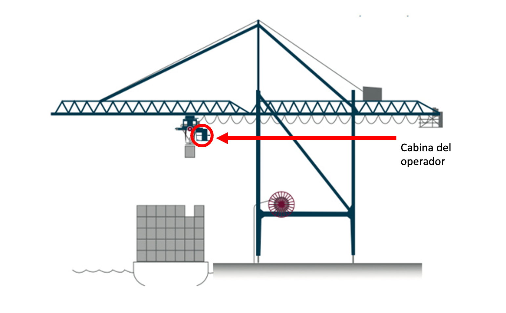
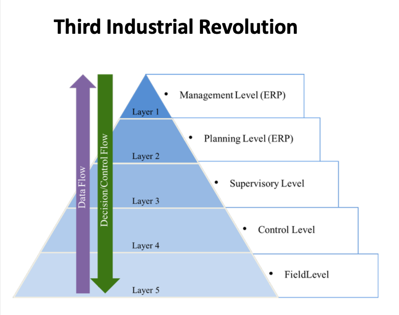
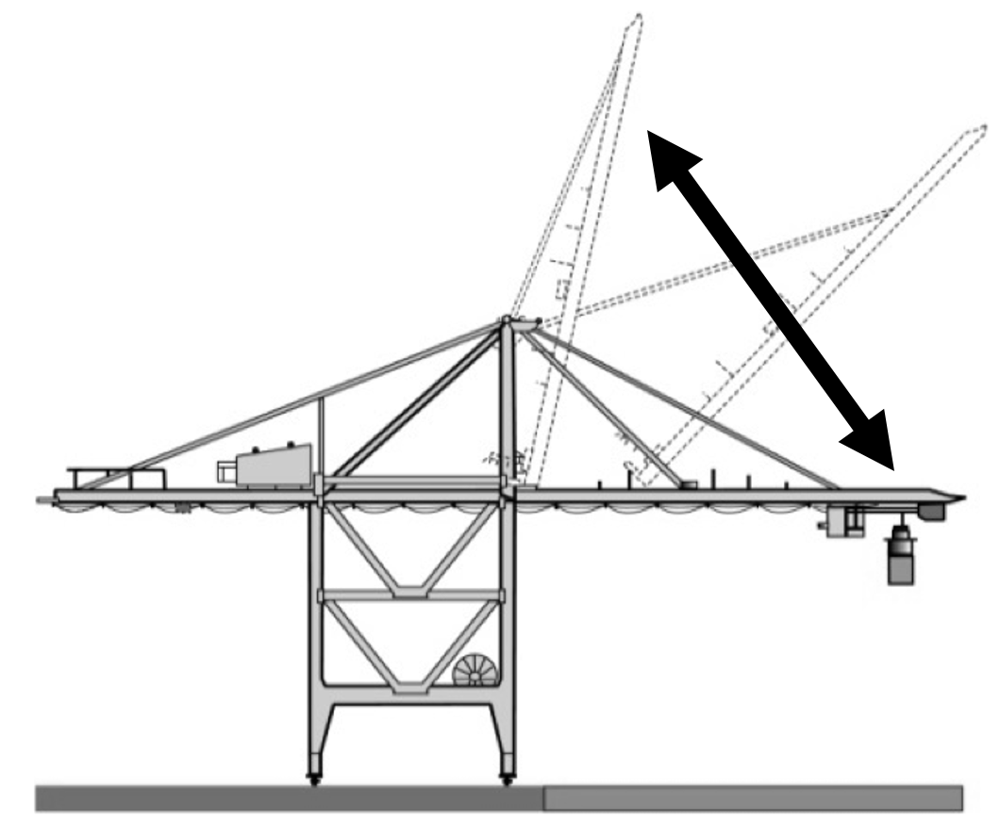
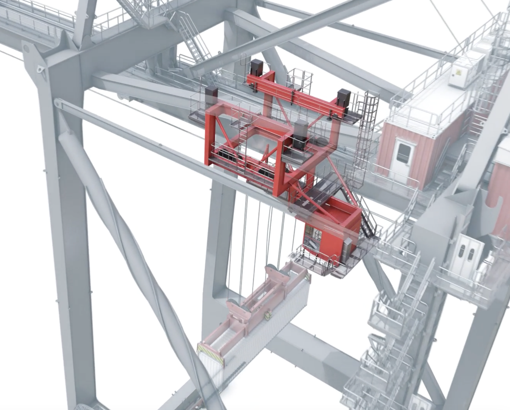
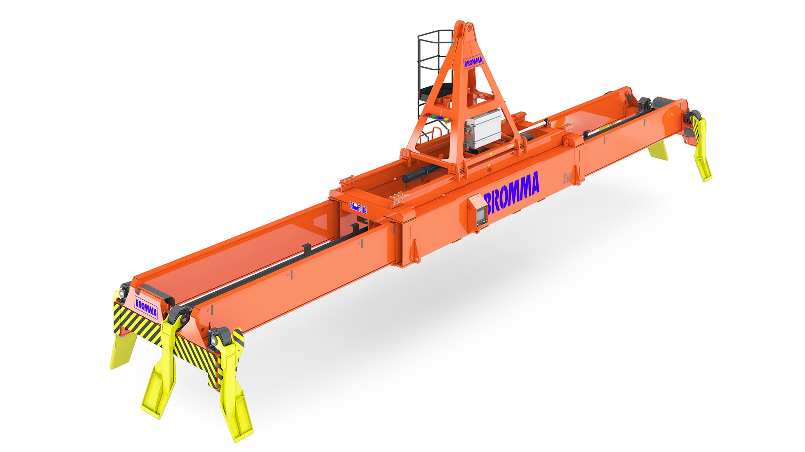
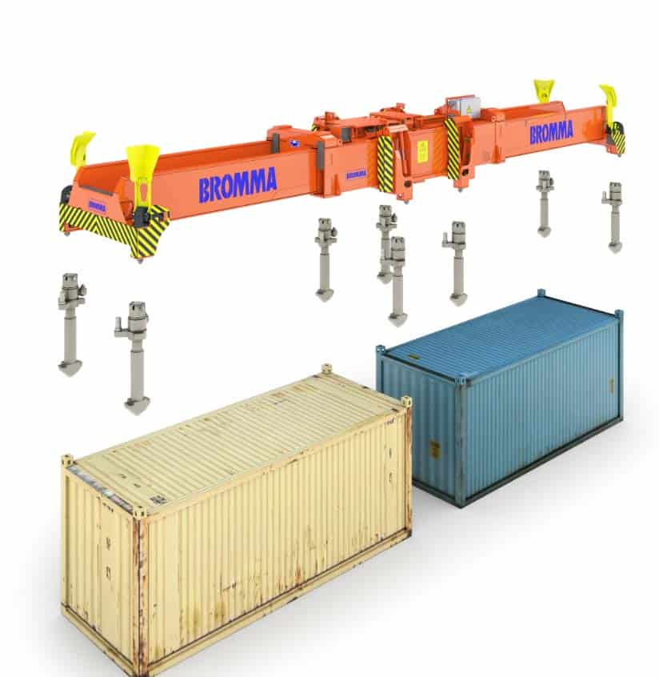
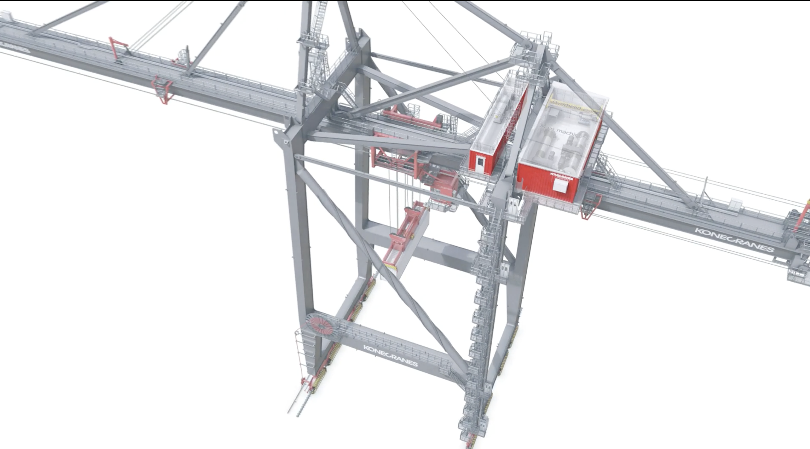
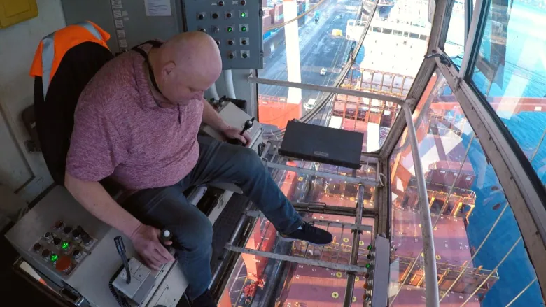

<!-- image -->

<!-- image -->

TESINA FINAL DE MÁSTER

**Sistema de control remoto para grúas portacontenedores con SCADA e inteligencia de negocios**

Alumno: **Carlos Alexis Zavala Galarce**

Máster en Implantación de Sistemas 
para la Industria 4.0

Convocatoria de defensa: **junio de 2024**

**ÍNDICE**

1	Resumen	1

2	Introducción	3

3	Objetivos	7

4	Descripción técnica de la máquina objetivo	9

4.1	Descripción general	9

4.2	Evolución de las grúas portacontenedores de muelle	9

4.3	Principales componentes móviles de las grúas portacontenedores	10

4.4	Sistema de control	16

4.5	Movimientos objeto de simulación	17

5	Arquitectura del sistema de control remoto	19

6	Desarrollo del sistema de control remoto del proyecto	21

6.1	Comunicación Controlador - IO Device	21

6.2	Transmisión de Audio y Video	21

6.3	Pruebas de Control Remoto en Línea Indexada	21

7	Desarrollo del sistema de captura y análisis de datos	23

7.1	Sistema Interfaz Hombre-Máquina (HMI)	23

7.2	Sistema SCADA y Gestión de Datos	23

7.3	Almacenamiento de datos	24

7.4	Herramienta para el análisis de datos	24

8	Limitaciones del proyecto	25

9	Análisis de los resultados	27

10	Conclusiones	29

11	Bibliografía	31

12	Anexos	33

## 1 Resumen

Este trabajo final de máster en la Universidad Politécnica de Valencia, titulado "Sistema de control remoto para grúas de muelle portacontenedores, con sistema SCADA y herramienta de inteligencia de negocios", se enfoca en la automatización industrial en terminales portuarios. Su principal objetivo es avanzar en la automatización de equipos con el fin de mejorar la eficiencia y seguridad en las operaciones de carga y descarga de buques mediante un sistema de control remoto para grúas tipo STS (Ship-to-shore).

La propuesta incluye la reubicación del PLC controlador a una sala de control, mejorando las condiciones laborales y la seguridad de los operadores. Se desarrolló una prueba de concepto que evalúa la viabilidad técnica del sistema, destacando la comunicación entre el PLC controlador y los dispositivos de entrada/salida, la transmisión en tiempo real de audio y video con WebRTC y un sistema HMI para control gráfico. El proyecto también integra tecnologías como SCADA para supervisión centralizada y herramientas de inteligencia de negocios para análisis de datos, donde además se configuró un servidor SQL para almacenamiento y análisis de datos históricos a través de Microsoft Power BI.

A pesar de las limitaciones, como el entorno de prueba simulado y la falta de equipamiento ideal, el proyecto demostró la viabilidad básica del sistema de control remoto, estableciendo una base sólida para futuros desarrollos. Las pruebas en un entorno operativo real y la adquisición de equipamiento adecuado son esenciales para futuras mejoras. Este proyecto representa un avance significativo en la automatización de terminales portuarios, y con ello la seguridad, eficiencia y capacidad de monitoreo de las operaciones.

## 2 

## 3 Introducción

El transporte marítimo concentra cerca del 90% del comercio mundial y cerca del 80% de su valoración, se transporta en contenedores. Considerando que además las grúas de muelle portacontenedores son las únicas capaces de transferir contenedores entre los barcos y los muelles, y viceversa (Ilustración 2-1), pequeñas mejoras en ellas pueden tener un gran impacto en el servicio que entrega a sus clientes (naves), en términos de productividad y eficiencia, mejorando la competitividad del puerto y la economía de su *hinterland.*

<!-- image -->

Ilustración 2-1 Grúa de muelle transfiriendo contenedores

Para introducir el problema, es importante destacar que en el territorio administrado por la Autoridad Portuaria de Valencia se dispone de un total de 48 de estas grúas. Sin embargo, solo en el puerto de Valencia operan 32 de ellas (Tabla 1), todas manejadas desde una cabina situada en lo alto, que sigue los movimientos horizontales del contenedor que traslada. Esta configuración presenta varias desventajas que afectan la salud del operador, su seguridad y la productividad de la operación.

Tabla 1 Cantidad de grúas de muelle portacontenedores en el puerto de Valencia (fuente: Anuario Estadístico 2020 de ValenciaPort)

<!-- image -->

En contraste al constante movimiento hacia adelante y hacia a atrás del operador, la operación a través de un sistema de control remoto apoyado con dispositivos de monitoreo y visión artificial puede otorgar los siguientes beneficios:

1. Seguridad
2. Mejora la visibilidad y campo de visión del operador. La cabina del operador siempre mira hacia el mar, por tanto, cuando el movimiento es desde la nave hacia el muelle, tanto la cabina como el operador avanzan de espaldas limitando notoriamente la capacidad de prevenir accidentes.
3. Acceso a aseos y servicios básicos. Las grúas no suelen estar equipadas con servicios de aseos. El relevo de operadores que supone una sala de control remoto es mucho más sencillo y menos expuesto que la realidad actual.
4. Los tiempos muertos en los cambios de turno se pueden reducir a segundos al no tener que desplazarse desde y hasta la cabina de operación
5. Se ahorran los recursos utilizados para el traslado de los operadores (vehículo y conductor), evitando además posibles estorbos y accidentes durante las operaciones de patio.

Orientado a obtener esos beneficios, este proyecto entrega un prototipo limitado que simula un sistema de control remoto para las grúas portacontenedores de muelle. A este prototipo se suman módulos de administración e inteligencia de datos con el objetivo de que el prototipo que alcance todos los niveles de la pirámide de la automatización (Imagen 2-1 Pirámide de la automatización). Para ello, en los siguientes capítulos se define una metodología de trabajo que comienza con la descripción de las grúas portacontenedores de muelle, los movimientos y los controles a programar en este proyecto. Con estos requerimientos se presenta la arquitectura y elementos que componen el sistema solución, y que finalmente son desarrollados y presentados junto a los resultados y conclusiones.

<!-- image -->

Imagen 2-1 Pirámide de la automatización

## 4 

## 5 Objetivos

El objetivo general del proyecto es contribuir a la construcción de un sistema de control remoto para grúas portuarias de tipo STS (Ship to shore) lo cual mejora la eficiencia, seguridad y capacidad de monitoreo de las operaciones portuarias. Para lograrlo, se plantearon los siguientes objetivos específicos:

- Definir y justificar el interés del proyecto.
- Describir funcional y técnicamente las grúas STS.
- Identificación de componentes y arquitectura necesaria para el sistema de control remoto de grúas STS.
- Montar la arquitectura definida y probarla.
- Implementar un sistema HMI para el control y monitoreo de la grúa.
- Configurar un sistema SCADA que permita la administración remota varias grúas simuladas.
- Almacenar el estado de los componentes simulados de la grúa.
- Utilizar herramientas de *business intelligence* para la visualización y análisis de datos históricos.

## 6 

## 7 Descripción técnica de la máquina objetivo

### 7.1 Descripción general

Las grúas portacontenedores de muelle son equipos utilizados por puertos y terminales marítimos para transferir contenedores entre el barco y el muelle. En la Imagen 4-1 se muestran 4 grúas portacontenedores de muelle (blancas) operando sobre un barco portacontenedores. También se pueden ver los camiones (o tractocamiones) sobre los cuales se posiciona el contenedor descargado de la nave.

<!-- image -->

Imagen 4-1 4 Grúas portacontenedores operando sobre un barco portacontenedores (Fuente: Pexel.com)

### 7.2 Evolución de las grúas portacontenedores de muelle

En la búsqueda de economías de escalas, el tamaño de los buques portacontenedores ha crecido constantemente. Esto obliga a que las grúas portacontenedores de muelle tengan que adaptarse para cubrir todo el ancho o manga del buque.

La Ilustración 4-1 muestra esta relación entre el crecimiento de las naves y el crecimiento de las grúas portacontendores de muelle.

<!-- image -->

Ilustración 4-1 Relación de dimensiones y capacidades del barco, con las dimenciones de grúas portacontenedores de muelle.

Por tanto, a medida que la grúa crece, la productividad también lo hace. Esto es debido a que el crecimiento de la grúa extiende también la distancia que debe recorrer el contenedor transferido. A la misma velocidad de movimiento, el tiempo necesario para transferir un contenedor aumenta.

### 7.3 Principales componentes móviles de las grúas portacontenedores

Los componentes móviles de las grúas portacontenedores de muelle claves para este proyecto son:

1. Pórtico ( *Gantry* ): El pórtico, es la estructura principal de la grúa, la cual está montada sobre rieles que se extienden a lo largo del muelle. Su función principal es permitir el traslado y posicionamiento de la grúa sobre los contenedores correctos en el barco o en el muelle.
<!-- image -->

<!-- image -->

Ilustración 4-2 A la izquierda, el pórtico y la estructura completa de la grúa. A la derecha, destacado en rojo, los carros que trasladan el pórtico por medio de rieles instalados a lo largo del muelle.

1. Brazo ( *Boom)* : El brazo es la parte de la estructura que se extiende hacia el buque. Por seguridad, es levantado cuando la grúa no está transfiriendo contenedores.
<!-- image -->

Ilustración 4-3 Movimientos del sistema de elevación de Pluma (Boom)

1. Carro ( *Trolley* ): El trolley es parte de la grúa que se desplaza a lo largo del brazo, entre el muelle y el barco. De este pende el telescópico ( *spreader* ) que lleva las fijaciones ( *twistlocks* ) para sujetar el contenedor. También arrastra la cabina del operador para mantener la visión sobre el telescópico y su objetivo.
<!-- image -->

Ilustración 4-4 Carro (trolley) sujetado al brazo y la cabina del operador más abajo, destacadas en rojo. Con cables bajo el carro pende el telescópico cargado de un contenedor.

1. Telescópico ( *Spreader* ): Es el aparato que cuelga del carro y se acopla a la parte superior de los contenedores. Se ajusta para manejar diferentes tamaños de contenedores, muchas veces 2 contenedores de 20 pies simultáneamente. Para fujarlos, lleva en sus esquinas, y a veces al centro, mecanismos con bloques giratorios ( *twistlocks* ) para fijar los contenedores.
<!-- image -->

Ilustración 4-5 Telescópico (spreader) sujetando 2 contenedores de 20 pies.

1. Aletas ( *Flippers* ): Mecanismos instalados en los extremos del utilizados para alinear y asegurar el correcto acoplamiento al contenedor.
<!-- image -->

<!-- image -->

Ilustración 4-6 A la izquierda, el telescópico con las aletas (en amarillo) activadas para guiar las fijaciones (twistlocks) hacia el contenedor. A la derecha, las aletas cuando están inactivas (levantadas).

1. Bloques giratorios ( *Twistlocks* ): Forman el mecanismo de bloqueo para sujetar el contenedor al telescópico durante el traslado. Estos dispositivos se giran para enganchar o desenganchar los contenedores del telescópico ( *spreader* ).
<!-- image -->

Ilustración 4-7 Bloques giratorios (twistlocks) entre el telescópico (arriba) y los contenedores (abajo).

1. Casa de máquinas ( *Machinery house* ): Es el compartimiento que protege los principales componentes mecánicos y eléctricos de las condiciones ambientales. Está sujeta sobre el brazo opuesto a la cabina del operador.
2. Mecanismo de elevación de la grúa ( *Hoist* ): Es el sistema de motores, engranajes, poleas y cables que permiten de elevación del telescópico. Está al interior de la casa de máquina para protección ambiental.
<!-- image -->

Ilustración 4-8 Sala de máquinas destacadas en rojo.

### 7.4 Sistema de control

En cuanto a los controles, y de forma simplificada, el mando derecho se utiliza para subir y bajar el telescópico, activar y desactivar las aletas, y activar y desactivar los bloques giratorios ( *twistlock* ). El mando izquierdo controla el carro, hacia adelante y atrás, desde la perspectiva del operador.

<!-- image -->

Ilustración 4-9 Cabina del operador

Como se puede apreciar en la Ilustración 4-10, la posición ergonómica requerida para la operación de la grúa. La constante aceleración y frenado hacia adelante y hacia atrás suele traer problemas de espalda en los operadores.

Ilustración 4-10 Posición y vista del operador de la grúa.

<!-- image -->

<!-- image -->

### 7.5 Movimientos objeto de simulación

Los movimientos que en este proyecto serán simulados son:

1. Sistema de elevación de pluma ( *Boom* ):

Acciones:

Subir y bajar la pluma.

1. Sistema de carretones del pórtico ( *Gantry* ):

Acciones:

Desplazamiento hacia izquierda y derecha.

1. Sistema de carro ( *Trolley* ):

Acciones:

Desplazamiento hacia adelante y atrás.

1. Sistema del telescópico ( *Spreader* ):

Acciones:

Subir y bajar el telescópico.

Activar y desactivar aletas.

Activar y desactivar bloques giratorios.

## 8 

## 9 Arquitectura del sistema de control remoto

En este capítulo se describe la arquitectura del sistema de control remoto para grúas portacontenedores de muelle, desarrollada en el marco del proyecto. Esta arquitectura ha sido diseñada para integrar diversos componentes tecnológicos que permitan una operación eficiente y segura de las grúas portacontenedores. Los elementos clave que la componen son:

- **PLC Controlador:** Actualmente, las grúas tienen este PLC en la cabina de control. En el nuevo sistema se trasladará, junto a todos los controles, hacia una sala de control y gestionará las operaciones principales de la grúa desde la sala de control.
- **PLC IO Device:** Este dispositivo sería instalado en la grúa y reemplazaría al PLC controlador actual. Actúa como intermediario entre el PLC Controlador y los sensores y actuadores de la grúa, retransmitiendo los inputs y outputs físicos a una muy baja latencia.
- **Mandos de Control:** Los mandos de control permiten a los operadores enviar ordenes al sistema.
- **Pantallas HMI:** Las pantallas HMI (Interfaz Hombre-Máquina), ubicadas en la sala de control, proporcionan una visualización en tiempo real del estado del equipo al mismo tiempo que permite enviar comandos.
- **Captura Multimedia:** Cámaras y micrófonos para transmitir video y audio en tiempo real desde la grúa hasta la sala de control. La transmisión de multimedia sería mediante el protocolo WebRTC, que asegura baja latencia y alta calidad.
- **Reproducción Multimedia:** Monitores y altavoces en la sala de control permiten a los operadores visualizar y escuchar las operaciones de la grúa.
- **Dispositivos de Codificación y Decodificación Multimedia:** Estos dispositivos procesan y transmiten las señales de audio y video capturadas a los medios de reproducción multimedia ubicados en la sala de control.
- **Sistema SCADA:** El sistema de Supervisión, Control y Adquisición de Datos (SCADA) es crucial para la administración centralizada de las operaciones de las grúas. Permite monitorear y controlar múltiples grúas desde una única plataforma.
- **Servidor de Base de Datos:** Para el almacenamiento de datos históricos de operación en series de tiempo, es necesario un servidor de base de datos estructurada del tipo SQL. Este servidor almacena información crítica sobre las operaciones de la grúa, que luego puede ser analizada para optimizar el rendimiento y la eficiencia.
- **Servidor de Aplicación de Inteligencia de Negocios:** Servidor o usuario final de aplicación de inteligencia de negocios, que permite analizar y visualizar los datos almacenados en el servidor de base de datos. Esta herramienta permite a los gestores tomar decisiones informadas basadas en datos históricos y en tiempo real.

De acuerdo con lo definido anteriormente, la arquitectura del sistema de control remoto para grúas portacontenedores de muelle se representa en el Diagrama 5-1 Arquitectura del sistema de control remoto del proyecto:

<!-- image -->

Diagrama 5-1 Arquitectura del sistema de control remoto del proyecto

Para el desarrollo del proyecto se planificó una secuencia de hitos que permitió alcanzar los objetivos gradualmente. Está planificación descompone el problema en dos subsistemas:

- Sistema de control remoto.
- Sistema de captura y análisis de datos.

## 10 

## 11 Desarrollo del sistema de control remoto del proyecto

El sistema de control remoto para las grúas portacontenedores se diseñó con el objetivo de mejorar la seguridad, la eficiencia y las condiciones laborales de los operadores. Este subsistema se compone de las siguientes tecnologías:

- Comunicación entre el PLC controlador y el PLC IO Device.
- Transmisión de audio y video para mejorar la percepción del lugar de operación.
- Pruebas de control remoto sobre el mecanismo de línea indexada.

A continuación, se describe cada una de ellas y se mencionan los documentos del proyecto que los materializa. La descripción específica de cada carpeta y documento se encuentra en el **Anexo 0 Archivos y carpetas resultado del proyecto** :

### 11.1 Comunicación Controlador - IO Device

El primer componente crítico en el desarrollo del sistema de control remoto es el establecimiento y prueba de la comunicación entre el PLC operando como IO Device y el PLC Controlador. Este proceso es esencial para asegurar que los datos se transfieran de manera fiable y eficiente entre los diferentes componentes del sistema. Para lograrlo, se utilizaron dispositivos Siemens S7-1200 y el protocolo de comunicación PROFINET, configurados a través del software TIA Portal.

Archivo relacionado:

- Línea Indexada IO Device

### 11.2 Transmisión de Audio y Video

La transmisión de audio y video es un componente crucial del sistema, ya que proporciona una visión en tiempo real de la operación de la grúa. Para esto, se utilizó el protocolo WebRTC, que permite la transmisión multimedia con baja latencia y alta calidad. Esta tecnología asegura que los operadores tengan una vista clara y precisa de los movimientos de la grúa.

Archivos relacionados:

- Web RTC Docker.txt
- Línea Indexada IO Device.M4V

### 11.3 Pruebas de Control Remoto en Línea Indexada

Para minimizar riesgos y asegurar la viabilidad técnica del sistema, se realizaron pruebas de control remoto sobre una línea indexada que actúa como sustituto de la grúa física. Estas pruebas permitieron ajustar y validar el comportamiento del sistema en un entorno seguro antes de su implementación final en el equipo real. Este enfoque garantiza que el sistema funcione correctamente y cumpla con las expectativas de rendimiento y seguridad.

Archivos relacionados:

- Línea Indexada IO Device.M4V

## 12 

## 13 Desarrollo del sistema de captura y análisis de datos

El sistema de captura y análisis de datos se diseñó para recopilar, almacenar y analizar los datos operativos de las grúas portacontenedores, proporcionando una plataforma robusta para la toma de decisiones informadas y la optimización de las operaciones. Está compuesto por:

- Sistema HMI para el monitoreo y control de la grúa.
- Sistema SCADA para una administración centralizada.
- Servidor de base de datos para el almacenamiento de datos.
- Herramientas de inteligencia de negocios para el análisis de datos.

### 13.1 Sistema Interfaz Hombre-Máquina (HMI)

Para replicar el comportamiento de la grúa en un entorno controlado, se desarrolló una simulación virtual utilizando un PLC dedicado. Esta simulación permite la lectura de posición y el control de las principales acciones de la grúa, asegurando que los controles y respuestas sean precisos y fiables. Sobre esto, se desarrolló un sistema HMI (Interfaz Hombre-Máquina) que permite a los operadores manipular la grúa mediante una interfaz gráfica.

Archivos relacionados:

- STS RC Simulado
- STS RC Simulado - SCADA HMI.mp4

### 13.2 Sistema SCADA y Gestión de Datos

El sistema SCADA (Supervisory Control and Data Acquisition) facilita la administración centralizada de las operaciones de las grúas portacontenedores. Configurado en TIA Portal con WinCC, el sistema SCADA permite monitorear y controlar múltiples grúas desde una plataforma única. Los componentes clave del sistema SCADA incluyen:

- Monitoreo en Tiempo Real: El sistema SCADA proporciona una visualización en tiempo real del estado de las grúas, mostrando la posición y estado de cada componente.
- Registro de Datos: Sobre este proyecto de TIA PORTAL se configura la comunicación con la base de datos para el almacenaje de ellos.

Archivos relacionados:

- STS RC Simulado

### 13.3 Almacenamiento de datos

El almacenamiento de datos es un componente crucial del sistema, asegurando que la información recopilada esté disponible para análisis y toma de decisiones. Para este propósito, se utiliza un servidor SQL Server (Localhost) que almacena en series de tiempo las posiciones de los componentes. La configuración del servidor SQL Server incluye:

- Instalación del motor de la base de datos: Tal como fue mencionado, se utiliza SQL Server versión 14.0.3465
- Creación de la base de datos: Para ello se utilizó SQL Server Management 20.1
- Estructura de Base de Datos: La base de datos está estructurada para almacenar grandes volúmenes de datos de manera eficiente. Para el proyecto se propuso una sola tabla con los registros de las variables y su valor cada cierto tiempo.

Archivos relacionados:

- STS RC Simulado
- STS RC Simulado - Base de datos.sql

### 13.4 Herramienta para el análisis de datos

Utilizando Power BI, se desarrolló una herramienta de inteligencia de negocios que permite analizar y visualizar los datos almacenados en el servidor SQL Server. Esta herramienta proporciona capacidades avanzadas de análisis de datos, incluyendo:

- Dashboards Interactivos: Power BI permite crear dashboards interactivos que muestran métricas clave de desempeño, tendencias históricas y análisis comparativos.
- Reportes Automatizados: Se configuran reportes automatizados que se generan y distribuyen periódicamente, facilitando la toma de decisiones informadas.

Archivos relacionados:

- STS RC Simulado.pbix.

## 14 

## 15 Limitaciones del proyecto

Durante el desarrollo de este proyecto de semi-automatización de grúas portacontenedores, se encontraron varias limitaciones que deben ser consideradas al evaluar los resultados y la viabilidad de la solución propuesta. A continuación, se detallan las principales limitaciones identificadas:

1. Entorno de Prueba Limitado:

No fue posible probar el sistema en un entorno real debido a restricciones de acceso seguridad. Las pruebas se realizaron en un entorno simulado, lo que puede no reflejar completamente las condiciones y desafíos operativos reales.

1. Capacidades del PLC IO Device:

El PLC IO Device mostró problemas al intentar realizar cálculos antes de enviar resultados. En teoría, el IO Device está diseñado para retransmitir a máxima velocidad, y cualquier procesamiento adicional puede introducir latencia y reducir la eficiencia del sistema.

1. Equipamiento Incompleto:

No se pudieron adquirir las cámaras y otros equipamientos ideales para el proyecto debido a limitaciones presupuestarias y de tiempo. Esto afectó la capacidad para implementar y probar completamente el sistema de transmisión de audio y video en tiempo real.

1. Prueba de Concepto:

Este proyecto se desarrolló como una prueba de concepto para evaluar la viabilidad técnica de la solución propuesta. Por lo tanto, algunas funcionalidades y optimizaciones no fueron objeto de implementación completa debido a las limitaciones del alcance del proyecto.

Todas estas limitaciones representan áreas de interés para futuros trabajos y mejoras de este mismo. A pesar de estos desafíos, el proyecto logró demostrar la viabilidad básica del sistema de control remoto y proporcionó una base sólida para desarrollos posteriores.

## 16 

## 17 Análisis de los resultados

El proyecto de semi-automatización de grúas portacontenedores desarrollado en el marco de este trabajo ha demostrado ser una solución viable y prometedora para mejorar la seguridad, eficiencia y capacidad de monitoreo en las operaciones portuarias. Para evaluar el éxito de este proyecto y facilitar la comprensión de los logros alcanzados, a continuación, se presenta una matriz que cruza los objetivos específicos con los resultados obtenidos.

| Objetivos                                              | Resultados Alcanzados                                                                                                                                                                                                             |
|--------------------------------------------------------|-----------------------------------------------------------------------------------------------------------------------------------------------------------------------------------------------------------------------------------|
| **Definir y justificar el interés del proyecto**       | El proyecto ha demostrado ser viable y prometedor para mejorar la seguridad, eficiencia y capacidad de monitoreo en las operaciones portuarias.                                                                                   |
| **Describir funcional y técnicamente las grúas STS**   | Se ha proporcionado una descripción detallada de las grúas STS, incluyendo sus componentes y movimientos, lo cual fue fundamental para el desarrollo de la arquitectura del sistema de control remoto.                            |
| **Identificar componentes y arquitectura del sistema** | Se identificaron y describieron todos los componentes necesarios, como el PLC Controlador, PLC IO Device, sistema SCADA, HMI, y dispositivos de transmisión multimedia, que forman la arquitectura del sistema de control remoto. |
| **Montar la arquitectura definida y probarla**         | Se implementó y probó la comunicación entre el PLC Controlador y el PLC IO Device, y se realizaron pruebas de control remoto sobre una línea indexada, validando la viabilidad técnica del sistema en un entorno simulado.        |
| **Implementar un sistema HMI**                         | Se desarrolló una interfaz Hombre-Máquina (HMI) que permite a los operadores controlar y monitorear las grúas de manera gráfica e intuitiva, mejorando la ergonomía y eficiencia operativa.                                       |
| **Configurar un sistema SCADA**                        | Se configuró un sistema SCADA utilizando TIA Portal y WinCC, proporcionando una plataforma centralizada para la administración y control de múltiples grúas en tiempo real.                                                       |
| **Almacenar el estado de los componentes simulados**   | Se implementó una base de datos SQL Server para el almacenamiento de datos históricos de operación en series de tiempo, asegurando la disponibilidad de información crítica para análisis y optimización de las operaciones.      |
| **Utilizar herramientas de BI para análisis de datos** | Se desarrolló una herramienta de inteligencia de negocios utilizando Power BI, que permite analizar y visualizar datos operativos, facilitando la toma de decisiones informadas.                                                  |

Tabla 2 Resultados alcanzados en el proyecto.

A pesar de las limitaciones, el proyecto ha alcanzado con éxito los objetivos planteados. Los logros también sientan una base sólida para futuras mejoras y desarrollos. Con pruebas adicionales y optimizaciones, el sistema propuesto tiene el potencial de mejorar significativamente la eficiencia y seguridad en la operación de grúas portuarias, posicionando a los terminales que adopten esta tecnología en la vanguardia de la automatización industrial.

## 18 

## 19 Conclusiones

El proyecto de semi-automatización de grúas portacontenedores alcanza avances significativos en la mejora de la seguridad, eficiencia y capacidad de monitoreo de las operaciones portuarias. Los principales logros del proyecto incluyen el desarrollo de una arquitectura capas de centralizar el control a través de la implementación de un PLC Controlador junto a un PLC IO Device, la integración de un sistema SCADA y HMI, el análisis de datos operativos y la transmisión multimedia en tiempo real.

Sin embargo, se encontraron algunas limitaciones que presentan oportunidades para futuros desarrollos. A continuación, se destacan las conclusiones más relevantes:

- **Centralización del Control**

La reubicación del PLC Controlador en una sala de control mejoraría notablemente la seguridad y condiciones laborales de los operadores, aunque se necesita seguir optimizando el entorno de trabajo para maximizar estos beneficios.

- **Retransmisión Eficiente con PLC IO Device**

La implementación del PLC IO Device ha demostrado ser eficiente en la retransmisión de inputs y outputs físicos y puede acelerar los tiempos de desarrollo y adaptación de grúas actuales.

- **Plataforma de Monitoreo Centralizada**

La integración del sistema SCADA y HMI ha proporcionado una plataforma robusta para el monitoreo y control en tiempo real que puede ser mejorada y eventualmente implementada.

- **Análisis de Datos Operativos**

El desarrollo de herramientas de inteligencia de negocios es posible con el análisis detallado de datos históricos y en tiempo real, permitiendo una toma de decisiones más informada y precisa.

- **Transmisión Multimedia en Tiempo Real**

A pesar de las limitaciones de equipamiento, se ha implementado un sistema básico de captura y transmisión de audio y video, mejorando la percepción del entorno operativo desde la sala de control.

Además de entregar valor, el proyecto también abre oportunidades de investigación y desarrollo. A continuación, se mencionan algunas para futuros interesados:

- **Pruebas en Entorno Real**

Es fundamental realizar pruebas en un entorno operativo real para validar completamente la solución propuesta y garantizar su eficacia bajo condiciones reales.

- **Adquisición de Equipamiento Adecuado**

En futuras fases del proyecto, se debe considerar la adquisición de equipamiento ideal, incluyendo cámaras y sistemas de transmisión multimedia de alta calidad, para mejorar la funcionalidad y fiabilidad del sistema.

- **Pruebas con 5G**

Las capacidades de la transmisión conocida como 5G puede mejorar significativamente la latencia de transmisión en ambos sentidos.

- **Ampliación del Sistema SCADA**

Explorar la integración del sistema SCADA y su navegador de internet con el protocolo WebRTC. Si bien se hizo un intento, las solución de los contratiempos implicaba salir del alcance, por lo que no fue abordado en este proyecto.

En resumen, el proyecto ha cumplido con los objetivos establecidos y ha sentado las bases para futuras mejoras e integraciones de tecnologías avanzadas en el ámbito de la automatización industrial en terminales portuarios.

## 20 

## 21 Bibliografía

- Wikipedia. Intermodal container [en línea]. [s.f.]. [Consultado el: 20 junio 2024]. Extraído de: [https://en.wikipedia.org/wiki/Intermodal\_container](https:/en.wikipedia.org/wiki/Intermodal_container)
- OECD. The main transport mode for global trade is ocean shipping: around 90% of traded goods are carried over the waves [en línea]. [s.f.]. [Consultado el: 20 junio 2024]. Extraído de: [https://www.oecd.org/ocean/topics/ocean-shipping/](https:/www.oecd.org/ocean/topics/ocean-shipping)
- Statista. Maritime shipping is the backbone of world trade; it is estimated that some 80 percent of all goods are carried by sea [en línea]. [s.f.]. [Consultado el: 20 junio 2024]. Extraído de: [https://www.statista.com/topics/1367/container-shipping/#topicOverview](https:/www.statista.com/topics/1367/container-shipping)
- Wikipedia. Hinterland [en línea]. [s.f.]. [Consultado el: 20 junio 2024]. Extraído de: [https://es.wikipedia.org/wiki/Hinterland](https:/es.wikipedia.org/wiki/Hinterland)
- Autoridad Portuaria de Valencia. Anuario Estadístico ValenciaPort 2020 [en línea]. 2020. [Consultado el: 20 junio 2024]. Extraído de: [https://www.valenciaport.com/wp-content/uploads/APV-Anuario-Estadistico-2020\_comp.pdf](https:/www.valenciaport.com/wp-content/uploads/APV-Anuario-Estadistico-2020_comp.pdf)
- Lucizano, C.; de Andrade, A. A.; Blumetti Facó, J. F.; de Freitas, A. G. Revisiting the Automation Pyramid for the Industry 4.0. En: 15th IEEE International Conference on Industry Applications (INDUSCON). São Bernardo do Campo, Brazil, 2023. pp. 1195-1198. doi:10.1109/INDUSCON58041.2023.10374996
- USC Sea Grant. Container cranes: Linking ship to shore [en línea]. [s.f.]. [Consultado el: 20 junio 2024]. Extraído de: [https://dornsife.usc.edu/uscseagrant/14-container-cranes-linking-ship-to-shore/](https:/dornsife.usc.edu/uscseagrant/14-container-cranes-linking-ship-to-shore)
- Konecranes. Ship-to-shore cranes [en línea]. [s.f.]. [Consultado el: 20 junio 2024]. Extraído de: [https://www.konecranes.com/port-equipment-services/container-handling-equipment/konecranes-ship-to-shore-cranes](https:/www.konecranes.com/port-equipment-services/container-handling-equipment/konecranes-ship-to-shore-cranes)
- Port Needs. Spreader [en línea]. [s.f.]. [Consultado el: 20 junio 2024]. Extraído de: [https://www.portneeds.com/detail-spreader-254](https:/www.portneeds.com/detail-spreader-254)
- Container Management. Twistlocks [en línea]. 5 de julio de 2016. [Consultado el: 20 junio 2024]. Extraído de: [https://container-mag.com/2016/07/05/12781/](https:/container-mag.com/2016/07/05/12781)

## 22 

## 23 Anexos

**Archivos y carpetas resultado del proyecto:**

- **STS RC Simulado (Carpeta)**

Descripción: Proyecto en TIA Portal utilizado para simular el control y calcular la posición y movimiento de la grúa.

- **STS RC Simulado - SCADA HMI.mp4**

Descripción: Video demostrando el funcionamiento del sistema SCADA y HMI en tiempo real.

- **Web RTC Docker.txt:**

Descripción: Archivo de configuración de Docker para la captura y transmisión de audio y video utilizando el protocolo WebRTC.

- **Línea Indexada IO Device.M4V:**

Descripción: Video demostrando el funcionamiento del proyecto "Línea Indexada IO Device", utilizando una botonera como control remoto y Docker para la transmisión de audio y video.

- **STS RC Simulado.pbix:**

Descripción: Proyecto en Microsoft PowerBI para el análisis de datos almacenados en el servidor SQL Server (localhost).

- **Base de datos:**

Descripción: Carpeta que contiene la configuración y estructura de la base de datos SQL Server utilizada para almacenar grandes volúmenes de datos de las operaciones de la grúa.

## Figures

