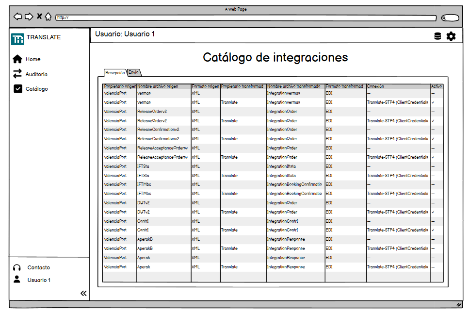
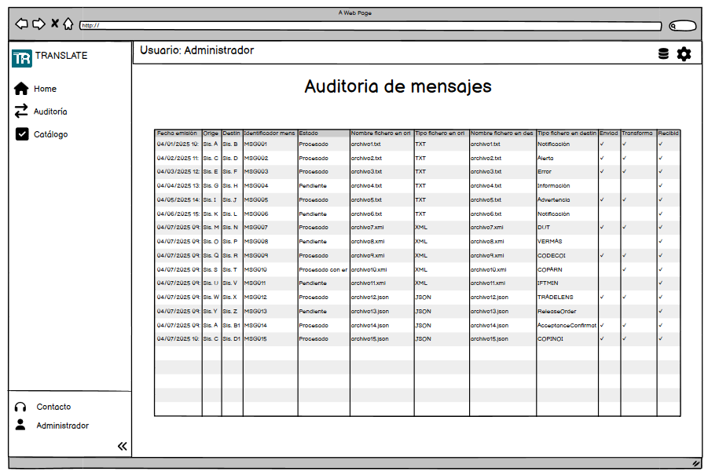

<!-- image -->

Código

TRANSLATE – E2.3

Fecha

Abril 2024

Versión

01

**Control de versiones**

| VERSIÓN   | FECHA   | DESCRIPCIÓN               |
|-----------|---------|---------------------------|
| 01        |         | Elaboración del documento |
|           |         |                           |
|           |         |                           |
|           |         |                           |

**Aprobación**

*Espacio reservado para firma*

## 1 Contenido

[1	Introducción	4](.)

[2	Descripción general	5](.)

[2.1	Objetivo de la web de administración	5](.)

[2.2	Requisitos de la interfaz de administración	5](.)

[2.2.1	Requisitos funcionales	5](.)

[2.2.2	Requisitos no funcionales	6](.)

[3	Análisis funcional	8](.)

[3.1	Gestión de empresas y usuarios	8](.)

[3.2	Catálogo de integraciones	8](.)

[3.3	Monitoreo y auditoría	8](.)

[3.4	Configuración de seguridad	9](.)

[3.5	Reportes y estadística	9](.)

[4	Prototipo de interfaz	10](.)

[4.1	Inicio de sesión	10](.)

[4.2	Dashboard	11](.)

[4.3	Catálogo de integraciones	12](.)

[4.4	Auditoría	13](.)

[5	Conclusiones	14](.)

## 2 Introducción

Este documento tiene como propósito definir funcionalmente la web de administración de la plataforma TRANSLATE, proporcionando una visión de las funcionalidades clave, los requisitos técnicos y las interacciones del sistema. La necesidad de contar con una web específica para la administración surge debido a la complejidad y seguridad de gestionar múltiples integraciones y comunicaciones en tiempo real. Esta interfaz asegura un control y monitoreo de servicios de manera centralizada y controlada. Además, este documento servirá como referencia para los equipos de desarrollo y operación del sistema.

Este documento no cubre el desarrollo de las funcionalidades fuera de la administración de la plataforma ni la implementación de cambios en los sistemas externos integrados.

## 3 Descripción general

### 3.1 Objetivo de la web de administración

El objetivo de la web de administración es proporcionar un entorno centralizado y seguro que permita la configuración, supervisión y operación eficiente de los componentes críticos de la plataforma TRANSLATE. Está orientada a facilitar la habilitación de servicios (recepción, transformación y envío de mensajes) que podrá ser activada por el usuario final.

### 3.2 Requisitos de la interfaz de administración

Este apartado recoge los requisitos funcionales específicos que deben implementarse a través de la interfaz web de administración de TRANSALTE. Estos se agrupan por dominios funcionales principales: Gestión de identidad, auditoría y errores.

#### 3.2.1 Requisitos funcionales

**Requisitos de gestión de identidad y accesos**

- Multiempresa y multidelegación:
    - Debe existir administración de entidades (empresa/delegación) y filtros en toda la UI.
- Gestión de identidades para autenticación y autorización:
    - El front aplica control de acceso por rol para mostrar/ocultar menús, acciones y datos.
- Gestión de permisos específicos para cada modelo de integración:
    - La UI debe permitir visibilidad y detallada por tipo de mensajes.
- Autenticación de usuario mediante usuario y contraseña:
    - Define los flujos de login/recuperación, políticas de contraseña, bloqueo y sesiones en la administración.

**Requisitos de procesamiento y transformación de mensajes**

- Procesar mensajes en diversos formatos según origen y destino:
    - Pantallas para asociar formatos y transformaciones por integración, validaciones previas y pruebas controladas desde UI.

**Requisitos de auditoría**

- Acceder a la trazabilidad de los mensajes mediante la auditoria:
    - Vistas y filtros por fechas, estado, carga/descarga y origen/destino.

**Requisitos de integraciones**

- Permitir la integración con sistemas externos para recibir y enviar mensajes:
    - Impone un catálogo de integraciones (envío y recepción).
- Permitir la integración de empresas con limitaciones técnicas:
    - Configuración para carga de archivos en UI (Translate Adapter).

**Requisitos de procesamiento y transformación de mensajes**

- Usar Cloud Storage y Blockchain para trazabilidad:
    - La UI expone descargas desde storage y evidencia de inmutabilidad en los datos de las transacciones.

**Gestión de errores y alertas**

- Proporcionar información detallada sobre errores
    - Muestra de Errores/Incidencias con detalle.

**Modelo de pago por uso y métricas**

- Cálculo de métricas de uso:
    - Dashboards y reportes con volumen de mensajes, datos y consumo por cliente/servicio como base de facturación.

**OpenData**

- Recolección de datos anonimizados:
    - Sección para previsualizar datasets agregados/anonimizados y publicar/actualizar en la web pública.

#### 3.2.2 Requisitos no funcionales

**Arquitectura**

- Implementar la solución en una plataforma cloud:
    - Debe convivir con múltiples instancias.
- Almacenamiento en la nube para guardar mensajes originales y transformados:
    - Implica un acceso para descargas seguras.

**Requisitos de interfaz de usuario**

- Interfaz de usuario intuitiva y fácil de usar:
    - Navegación simple, lenguaje claro, accesibilidad, pruebas de usabilidad y soporte multidispositivo (responsive).
- Acceso web a la interfaz de usuario:
    - Aplicación responsive, compatible con navegadores principales, autenticación segura para acceso remoto y actualizaciones sin instalación.
- Mantener un diseño coherente en todas las pantallas:
    - Guía de estilo y componentes reutilizables.
- Permitir la adaptación de la interfaz a diferentes roles de usuario:
    - Vistas/menús dinámicos por rol y control de acceso.
- Feedback y ayuda contextual al usuario:
    - Mensajes claros y ayudas contextuales multilingüe.

**Requisitos de rendimiento**

- Alta disponibilidad:
    - Debe tolerar despliegues y fallos manteniendo al usuario conectado.
- Soporte para picos de demanda:
    - Condiciona patrones de UI alineados a la alta demanda.

## 4 Análisis funcional

Este apartado detalla, a partir de los requisitos funcionales y no funcionales, la estructura de la web de administración de TRANSLATE, dividiendo sus funcionalidades en módulos. A través de esta sección se describen los componentes funcionales clave y se enlazan historias de usuario específicas que respaldan cada módulo.

### 4.1 Gestión de empresas y usuarios

- **Inicio de sesión:** Como usuario registrado, quiero iniciar sesión con mis credenciales (usuario y contraseña), para acceder a mis funcionalidades y datos personalizados.
- **Recuperación de contraseña:** Como usuario, quiero recuperar mi contraseña si la olvido, para restablecer el acceso a mi cuenta.
- **Roles del producto:** Como administrador, quiero configurar distintos roles en el sistema para asignar permisos diferenciados según el tipo de usuario (admin, operador, etc.).
- **Opciones de acceso:** Como administrador, quiero definir qué acciones puede ejecutar cada tipo de usuario para garantizar seguridad y control de operaciones.

### 4.2 Catálogo de integraciones

- **Visualización del catálogo de integraciones:** Como administrador, quiero consultar las integraciones disponibles clasificadas por tipo (envío y recepción) para entender que configuraciones están disponibles.
- **Tipo de mensajes:** Como administrador, quiero ver y gestionar los diferentes tipos de mensajes admitidos por la plataforma para asegurar la interoperabilidad.
- **Tipo de formatos:** Como administrador, quiero conocer los formatos aceptados por el sistema para asegurar la compatibilidad de los mensajes enviados.
- **Propietario de mensajes:** Como administrador, quiero identificar qué entidad es la responsable de cada tipo de mensaje para facilitar el soporte y trazabilidad.
- **Tipo de conexión y parámetros:** Como administrador, quiero consultar los tipos de conexión soportados y sus parámetros asociados para configurar correctamente una integración.

### 4.3 Monitoreo y auditoría

- **Auditoría y trazabilidad de mensajes:** Como administrador, quiero descargar y auditar los mensajes enviados, transformados y recibidos, junto con sus estados, para garantizar la trazabilidad y solución de errores.
- **Estados del mensaje:** Como administrador, quiero visualizar los diferentes estados que puede tener un mensaje (pendiente, procesado, error, omitido) para monitorear su evolución y gestionar incidencias.
- **Almacenamiento en la nube para mensajes:** Como administrador del sistema, quiero almacenar los mensajes originales y transformados en un sistema de almacenamiento en la nube para garantizar flexibilidad y escalabilidad.

### 4.4 Configuración de seguridad

- **Tipo de roles (Keycloak):** Como administrador de seguridad, quiero consultar y utilizar los tipos de roles definidos en el sistema de identidades (KeyCloak) para asignarlos adecuadamente a los usuarios de cada empresa.

### 4.5 Reportes y estadística

- **Generación de reportes de uso por cliente:** Como proveedor del sistema, quiero generar un reporte detallado de uso que incluya el número de mensajes procesados, transformados y enviados por cada cliente, desglosados por mes, para calcular los costos asociados al servicio.
- **Descarga de reportes personalizados de facturación:** Como proveedor del sistema, quiero descargar reportes personalizados con información específica sobre tipos de mensajes y destinos utilizados por un cliente, para preparar facturas detalladas que incluyan solo los servicios contratados.
- **Historial de reportes de uso y facturación:** Como proveedor del sistema, quiero acceder a un historial de reportes generados previamente, para responder a consultas o realizar auditorías internas.

## 5 Prototipo de interfaz

Este capítulo describe los componentes visuales y las funcionalidades principales que estarán disponibles en la interfaz web de administración de TRANSLATE. Cada sección incluye un ejemplo funcional del comportamiento esperado desde la perspectiva del usuario final.

En este punto es importante destacar que la gestión de usuarios, permisos y roles no se realizará directamente desde esta web, sino que estará delegada al Identity Manager del sistema, KeyCloak en este caso. Este componente es responsable de autenticar a los usuarios y gestionar sus derechos de acceso según la configuración realizada por cada empresa o delegación, conforme a lo definido en la arquitectura general de la plataforma.

### 5.1 Inicio de sesión

En esta sección se presenta el formulario de inicio de sesión para los usuarios de la plataforma TRANSLATE. Este punto de entrada es esencial para garantizar que solo los usuarios autorizados puedan acceder a las funcionalidades del sistema.

<!-- image -->

### 5.2 Dashboard

El dashboard actúa como pantalla principal para los usuarios autenticados como administradores. Desde aquí se puede obtener una visión general del estado del sistema, acceder rápidamente a las funcionalidades clave y monitorear indicadores relevantes.

<!-- image -->

### 5.3 Catálogo de integraciones

Esta sección permite a los usuarios consultar las integraciones disponibles y activas, clasificadas por tipo de mensaje, formato, origen y destino. El objetivo es facilitar la administración de las conexiones configuradas en la plataforma.

<!-- image -->

### 5.4 Auditoría

La sección de auditoría proporciona herramientas para el seguimiento detallado de los mensajes procesados por la plataforma. Permite aplicar filtros, revisar trazabilidad, descargar mensajes y diagnosticar errores o anomalías.

<!-- image -->

## 6 Conclusiones

Este análisis proporciona un marco claro para el diseño y desarrollo de la web de administración de TRANSLATE. Los siguientes pasos incluyen la implementación de prototipos, pruebas de validación y ajustes funcionales según las necesidades identificadas durante el desarrollo.

## Figures

<!-- Image extraction failed: No image data available -->
[Image: Figure fig_5]
