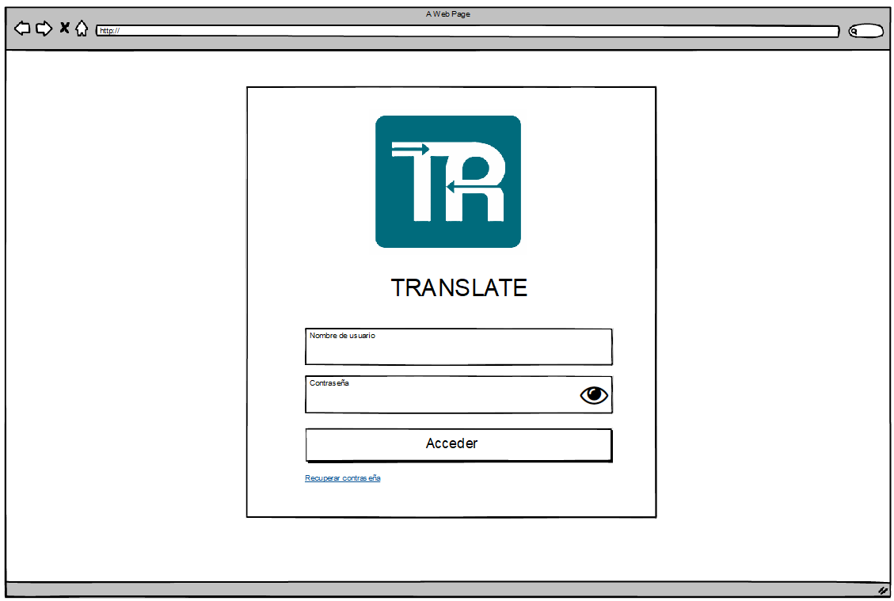
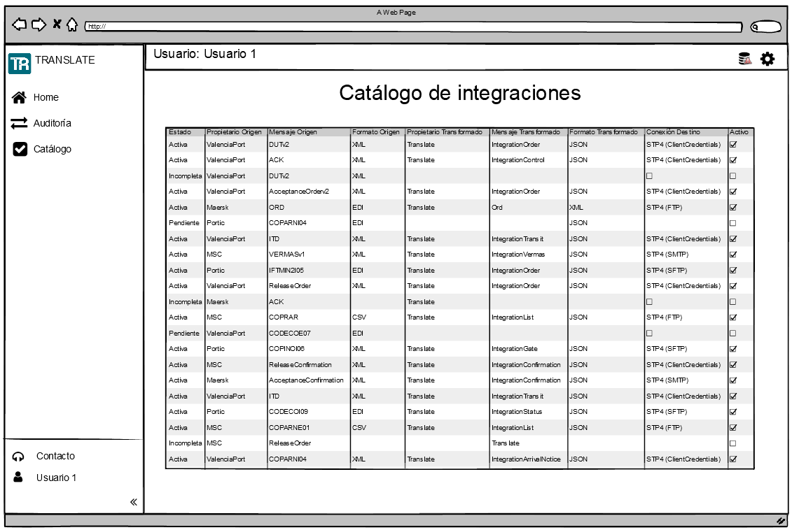
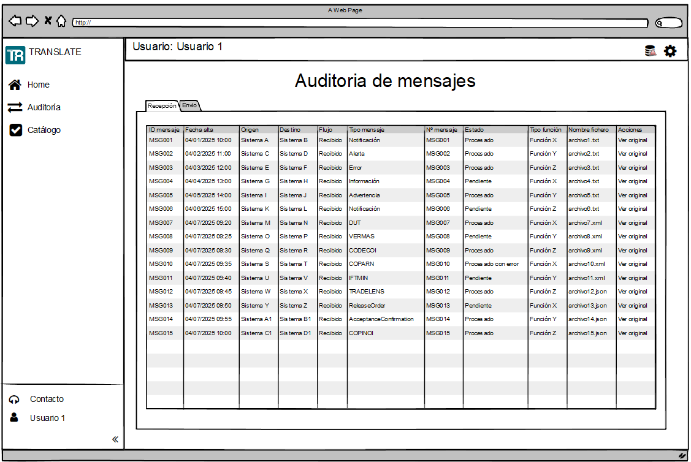

<!-- image -->

Código

TRANSLATE – E2.4

Fecha

Abril 2024

Versión

01

**Control de versiones**

| VERSIÓN   | FECHA   | DESCRIPCIÓN               |
|-----------|---------|---------------------------|
| 01        |         | Elaboración del documento |
|           |         |                           |
|           |         |                           |
|           |         |                           |

**Aprobación**

*Espacio reservado para firma*

## 1 Contenido

[1	Introducción	4](.)

[2	Descripción general	5](.)

[2.1	Objetivo de la web de cliente.	5](.)

[2.2	Requisitos de la interfaz de cliente	5](.)

[2.2.1	Requisitos de Translate Adapter	5](.)

[2.2.2	Requisitos funcionales	5](.)

[2.2.3	Requisitos no funcionales	6](.)

[3	Análisis funcional	8](.)

[3.1	Módulos	8](.)

[3.1.1	Gestión de empresas y usuarios	8](.)

[3.1.2	Catálogo de integraciones	8](.)

[3.1.3	Monitoreo y auditoría	8](.)

[4	Prototipo de interfaz	9](.)

[4.1	Inicio de sesión	9](.)

[4.2	Dashboard	10](.)

[4.3	Catálogo de integraciones	11](.)

[4.4	Auditoría	12](.)

[4.5	TRANSLATE ADAPTER	13](.)

[5	Conclusiones	15](.)

## 2 Introducción

Este documento describe el análisis funcional de la web de cliente de la plataforma TRANSLATE. Esta interfaz proporciona a los usuarios herramientas de supervisión y consulta que facilitan el seguimiento de las operaciones realizadas a través del sistema, especialmente las vinculadas al intercambio electrónico de mensajes y su trazabilidad.

TRANSLATE es una plataforma concebida fundamentalmente como sistema de integración entre plataformas digitales, orientado a funcionalidades de back-end. Por ello, la web de cliente mantiene un alcance funcional acotado, centrado en trazabilidad, consulta y acceso controlado a los servicios habilitados por cada empresa. La web de cliente es complementaria a la web de administración y está orientada a organizaciones que hacen uso de los servicios de interoperabilidad que ofrece TRANSLATE.

Como extensión de este alcance, TRANSLATE ADAPTER incorpora en la propia web de cliente la capacidad de cargar, validar, transformar y enviar mensajes de forma consecutiva sin necesidad de integrar el software del cliente. Esta funcionalidad está diseñada para organizaciones con capacidades técnicas limitadas o en fases tempranas de adopción, garantizando en todo momento control de acceso por roles, registro de actividad y trazabilidad de extremo a extremo.

## 3 Descripción general

### 3.1 Objetivo de la web de cliente.

TRANSLATE está concebido principalmente como un sistema orientado a la comunicación automática entre sistemas, es decir, sin interacción humana. Por ello, desde el punto de vista del cliente, la web se centra en **consulta, trazabilidad y gestión básica** de los servicios utilizados. En este sentido, las funcionalidades disponibles se enfocan en:

- Consultar el estado y traza de sus mensajes.
- Visualizar la configuración de sus integraciones activas.
- Descargar mensajes, transformaciones y reportes de uso.
- Cargar, validar, transformar y enviar archivos de forma consecutiva cuando el cliente no dispone de integración directa.

### 3.2 Requisitos de la interfaz de cliente

Este apartado recoge los requisitos específicos que deben implementarse a través de la interfaz web de clinete de TRANSALTE. Estos se agrupan por dominios funcionales principales: Gestión de identidad, auditoría y errores. Por el lado de los requisitos no funcionales, estos se agrupan en: Arquitectura, Diseño, Seguridad, Rendimiento y Mantenimiento.

#### 3.2.1 Requisitos de Translate Adapter

- Carga de archivos individuales o por lotes, con validaciones de extensión, tamaño, duplicidad (hash) y metadatos requeridos.
- Selección de plantilla de transformación asociada (p. ej., IFCSUM, CUSRES, BERMAN).
- Ejecución consecutiva “Transformar y Enviar” con publicación en la cola/broker registro en auditoría del mensaje o lote.
- Gestión de resultados por archivo (OK/KO), reintentos controlados y log descargable (CSV/JSON) de incidencias del procesamiento.

#### 3.2.2 Requisitos funcionales

**Gestión de Identidad y Accesos**

- Multiempresa y multidelegación
    - La plataforma debe ser configurable para múltiples empresas y delegaciones
- Gestión de identidades para autenticación y autorización
    - Implementar un **Identity Manager** para autenticar y autorizar usuarios y aplicaciones.
- Autenticación de usuario mediante usuario y contraseña
    - Debe permitir la autenticación de usuario por usuario-clave.

**Auditoría**

- Acceder a la trazabilidad de los mensajes mediante la auditoría
    - Permitir la descarga y auditoría en tiempo real de los mensajes enviados, transformados y recibidos, y sus estados, a través de la interfaz web.

**Información de errores**

- Proporcionar información sobre errores por la interfaz web.

**Modelo de pago por uso**

- Facilitar al usuario la suscripción a tipos de mensajes y origen/destino.

#### 3.2.3 Requisitos no funcionales

**Requisitos de arquitectura**

- Implementar la solución en una plataforma Cloud.
- Usar almacenamiento en la nube para guardar mensajes originales y transformados

**Requisitos de diseño de interfaz de usuario**

- Interfaz de usuario intuitiva y fácil de usar
    - Desarrollar una interfaz web intuitiva y mínima para el usuario de la aplicación TRANSLATE.

**Requisitos de seguridad**

- Autenticación y acceso seguros
    - Garantizar la autenticación segura de usuarios.
- Protección de datos en tránsito y en reposo
    - Autenticación con OAuth 2.0 y encriptación TLS/SSL para protección de accesos y datos.
    - Considerar certificados digitales de clientes para garantizar la autenticidad ante el destinatario.

**Requisitos de rendimiento**

- Asegurar una alta disponibilidad del sistema.
- Optimizar los tiempos de respuesta y carga para mejorar la experiencia del usuario.

**Requisitos de mantenimiento**

- Gestión eficiente de recursos
    - Priorizar la eficiencia operativa y la experiencia del usuario en las tareas de mantenimiento.

## 4 Análisis funcional

Este apartado detalla, a partir de los requisitos funcionales y no funcionales, la estructura de la web d de TRANSLATE, dividiendo sus funcionalidades en módulos. A través de esta sección se describen los componentes funcionales clave y se enlazan historias de usuario específicas que respaldan cada módulo.

### 4.1 Módulos

#### 4.1.1 Gestión de empresas y usuarios

- **Inicio de sesión:** Como usuario registrado, quiero iniciar sesión con mis credenciales (usuario y contraseña), para acceder a mis funcionalidades y datos personalizados.
- **Recuperación de contraseña:** Como usuario, quiero recuperar mi contraseña si la olvido, para restablecer el acceso a mi cuenta.

#### 4.1.2 Catálogo de integraciones

- **Visualización del catálogo de integraciones:** Como usuario, quiero consultar las integraciones disponibles clasificadas por tipo (envío y recepción) para entender que configuraciones están activas y cuales se pueden activar.

#### 4.1.3 Monitoreo y auditoría

- **Auditoría y trazabilidad de mensajes:** Como usuario, quiero descargar y auditar los mensajes enviados, transformados y recibidos, junto con sus estados, para garantizar la trazabilidad.
- **Estados del mensaje:** Como usuario, quiero visualizar los diferentes estados que puede tener un mensaje (pendiente, procesado, error, omitido) para monitorear su evolución y gestionar incidencias.
- **Almacenamiento en la nube para mensajes:** Como usuario del sistema, quiero descargar los mensajes originales y transformados a través de un sistema de almacenamiento en la nube.

## 5 Prototipo de interfaz

Este capítulo describe los componentes visuales y las funcionalidades principales que estarán disponibles en la interfaz web de administración de TRANSLATE. Cada sección incluye un ejemplo funcional del comportamiento esperado desde la perspectiva del usuario final.

En este punto es importante destacar que la gestión de usuarios, permisos y roles no se realiza directamente desde esta interfaz, sino que está delegada al Identity Manager del sistema, KeyCloak en este caso. Este componente es responsable de autenticar a los usuarios y gestionar sus derechos de acceso según la configuración realizada por cada empresa o delegación, conforme a lo definido en la arquitectura general de la plataforma.

### 5.1 Inicio de sesión

En esta sección se presenta el formulario de inicio de sesión para los usuarios de la plataforma TRANSLATE. Este punto de entrada es esencial para garantizar que solo los usuarios autorizados puedan acceder a las funcionalidades del sistema.

<!-- image -->

### 5.2 Dashboard

El dashboard actúa como pantalla principal para los usuarios autenticados como administradores. Desde aquí se puede obtener una visión general del estado del sistema, acceder rápidamente a las funcionalidades clave y monitorear indicadores relevantes.

<!-- image -->

### 5.3 Catálogo de integraciones

Esta sección permite a los usuarios consultar las integraciones disponibles y activas, clasificadas por tipo de mensaje, formato, origen y destino. El objetivo es facilitar la administración de las conexiones configuradas en la plataforma.

<!-- image -->

### 5.4 Auditoría

La sección de auditoría proporciona herramientas para el seguimiento detallado de los mensajes procesados por la plataforma. Permite aplicar filtros, revisar trazabilidad, descargar mensajes y diagnosticar errores o anomalías.

<!-- image -->

### 5.5 TRANSLATE ADAPTER

La sección TRANSLATE ADAPTER permite a los usuarios cargar, validar, transformar y enviar archivos directamente desde la web de cliente, sin requerir una integración técnica con sus propios sistemas. Facilita el intercambio de mensajes con el Port Community System y otros destinos, manteniendo la trazabilidad completa del proceso. Desde esta pantalla, el usuario puede seleccionar la integración correspondiente, revisar los resultados de la transformación y consultar el estado de envío de cada archivo.

<!-- image -->

<!-- image -->

## 6 Conclusiones

La web de cliente de TRANSLATE constituye una herramienta fundamental para empoderar a los operadores logísticos, ofreciéndoles trazabilidad y control en la gestión de sus mensajes y servicios contratados.

No obstante, es importante resaltar que su alcance funcional es acotado. Al estar TRANSLATE centrado en la comunicación automatizada entre sistemas, la web del cliente se concibe como un visor de apoyo a esa lógica de integración. Por tanto, su propósito principal no es la operación directa sobre los mensajes ni la configuración avanzada, sino ofrecer una experiencia sencilla de consulta, trazabilidad y diagnóstico que complemente los servicios de backend.

Su diseño modular, interfaz sencilla y enfoque en la experiencia del usuario facilitarán una adopción rápida y un uso efectivo por parte de los clientes.

## Figures

<!-- Image extraction failed: No image data available -->
[Image: Figure fig_7]
