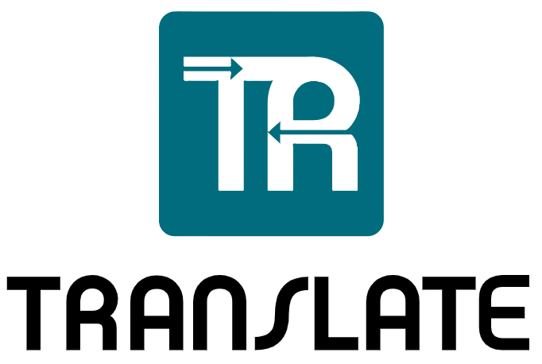
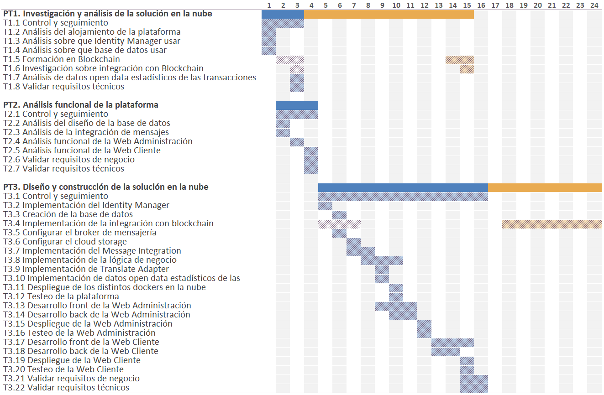
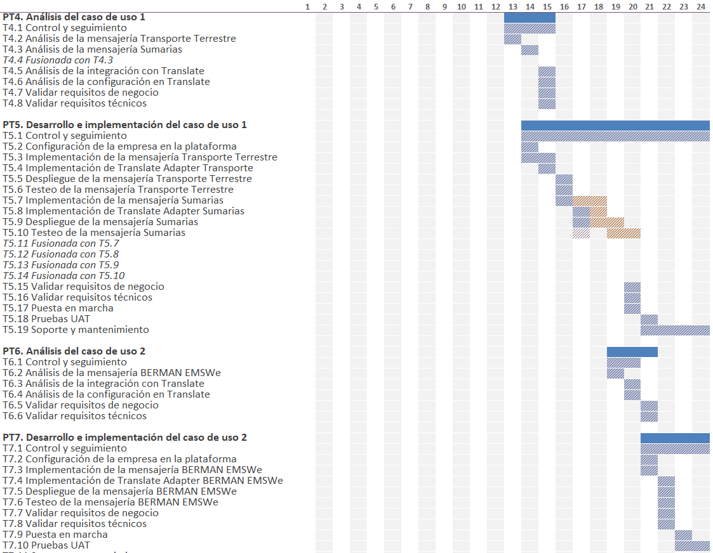

Fecha

14/11/2025

Versión

01

<!-- image -->

**2ª aclaración a la solicitud de modificaciones**

## 1 Antecedentes

De acuerdo con la solicitud de aportación de aclaraciones respecto a la modificación solicitada en el marco del proyecto Pre-Comercial PC-3.060, denominado “TRANSLATE. PLATAFORMA DE SERVICIOS DE INTERCAMBIO DE MENSAJERÍA ABIERTA E INTEROPERABLE PARA LOGÍSTICA PORTUARIA”, en el marco del plan de impulso al emprendimiento para la innovación en el sector portuario (Puertos 4.0), en este documento se presenta cronograma corregido, renombrando las actividades relativas a la plataforma TRADELENS y caso de uso de MSC.

## 2 Cronograma corregido

#### 1 Requerimiento

**En la documentación enviada, si bien se aporta un nuevo cronograma con las modificaciones temporales previstas relativas a las actividades de blockchain, en los PT 6 y 7 se sigue haciendo mención a la plataforma TRADELENS en vez de BERMAN EMSWe.**

**Enviar cronograma de ejecución corregido.**

#### 2 Respuesta

En el cronograma que incluye las correcciones, se tiene en cuenta lo ya expuesto en la solicitud inicial en cuanto a que los casos de uso de **MSC (CR-001) y APV (CR-002)** implican cambios en las actividades internas de los PT, que no alteran el cronograma global del proyecto.

Se reflejan los siguientes cambios (trasladados literalmente del documento inicial de solicitud de cambios):

Paquete de trabajo PT4: Análisis del caso de uso 1

- **T4.3 Análisis de la mensajería Vermas (Peso Bruto Verificado)** y **T4.4 Análisis de la mensajería Listas de Carga/Descarga** : ambas tareas se cancelan y se crea una nueva actividad equivalente, T4.3 Análisis de la mensajería Sumarias (IFCSUM).

Paquete de trabajo PT5: Desarrollo e implementación del caso de uso 1

- **T5.7 Implementación de la mensajería Vermas y T5.11 Implementación de la mensajería Listas de Carga/Descarga** : ambas tareas se cancelan y se crea una nueva actividad equivalente, T5.7 Implementación de la mensajería Sumarias (IFCSUM).
- **T5.8 Implementación de Translate Adapter Vermas y T5.12 Implementación de Translate Adapter Listas Carga/Descarga** : ambas tareas se cancelan y se crea una nueva actividad equivalente, T5.8 Implementación de Translate Adapter Sumarias (IFCSUM).
- **T5.9 Despliegue de la mensajería Vermas y T5.13 Despliegue de la mensajería Listas de Carga/Descarga** : ambas tareas se cancelan y se crea una nueva actividad equivalente, T5.9 Despliegue de la mensajería Sumarias (IFCSUM).
- **T5.10 Testeo de la mensajería Vermas y T5.6 Testeo de la mensajería Listas de Carga/Descarga** : ambas tareas se cancelan y se crea una nueva actividad equivalente, T5.10 Testeo de la mensajería Sumarias (IFCSUM).

Paquete de trabajo PT6: Análisis del caso de uso 2

- **T6.2 Análisis de la mensajería con Tradelens** : se cancela y se crea una nueva actividad equivalente, T6.2 Análisis de la mensajería BERMAN EMSWe.

Paquete de trabajo PT7: Desarrollo e implementación del caso de uso 2

- **T7.3 Implementación de la mensajería con Tradelens** : se cancela y se crea una nueva actividad equivalente, T7.3 Implementación de la mensajería BERMAN EMSWe.
- **T7.4 Implementación de Translate Adapter con Tradelens** : se cancela y se crea una nueva actividad equivalente, T7.4 Implementación de Translate Adapter BERMAN EMSWe.
- **T7.5 Despliegue de la mensajería con Tradelens** : se cancela y se crea una nueva actividad equivalente, T7.5 Despliegue de la mensajería BERMAN EMSWe.
- **T7.6 Testeo de la mensajería con Tradelens** : se cancela y se crea una nueva actividad equivalente, T7.6 Testeo de la mensajería BERMAN EMSWe.
<!-- image -->

El cronograma actualizado, a continuación, refleja las tareas afectadas por los cambios introducidos, donde  indica su reprogramación.

<!-- image -->

<!-- image -->

## Figures

<!-- Image extraction failed: No image data available -->
[Image: Figure fig_4]

<!-- Image extraction failed: No image data available -->
[Image: Figure fig_5]

<!-- Image extraction failed: No image data available -->
[Image: Figure fig_6]
