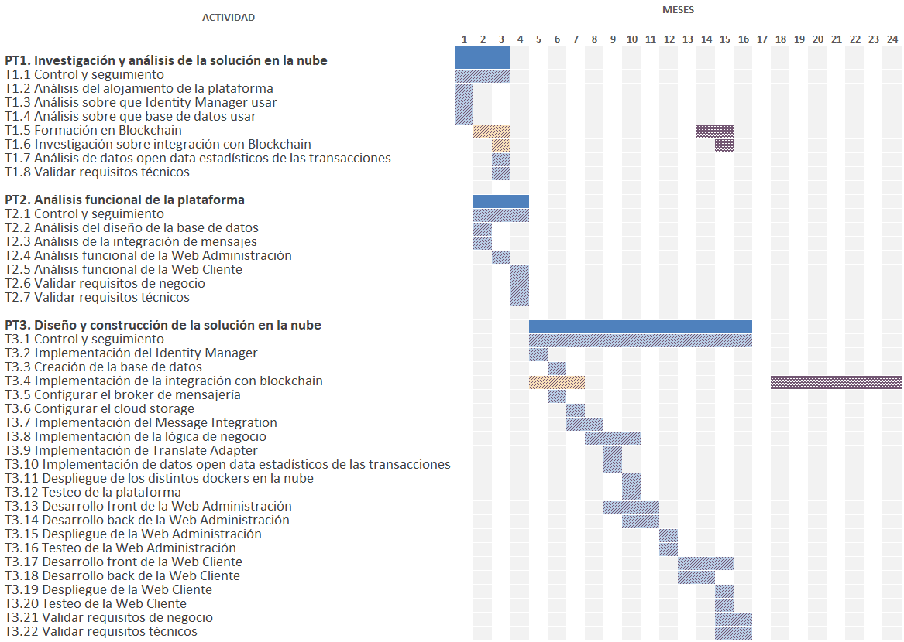
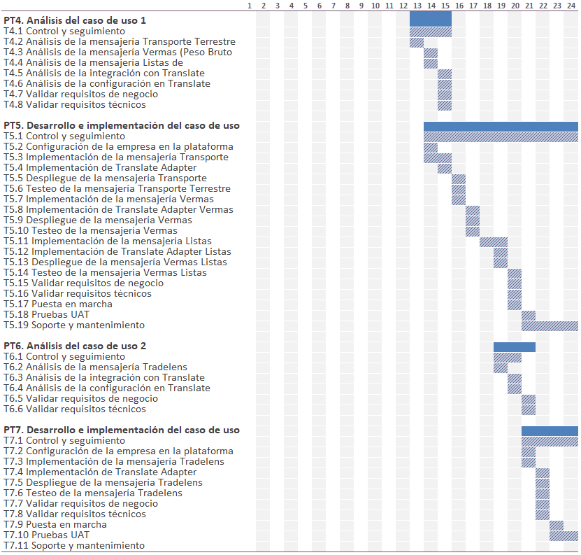

Fecha

30/09/2025

Versión

01

<!-- image -->

**Aclaraciones a la solicitud de modificaciones**

## 1 Contenido

[Aspectos generales	3](.)

[1	Primer requerimiento	5](.)

[Respuesta	5](.)

[2	Segundo requerimiento	7](.)

[Respuesta	7](.)

[3	Tercer requerimiento	9](.)

[Respuesta	9](.)

## 2 Aspectos generales

De acuerdo con la solicitud de aportación de aclaraciones respecto a la modificación solicitada en el marco del proyecto Pre-Comercial PC-3.060, denominado “TRANSLATE. PLATAFORMA DE SERVICIOS DE INTERCAMBIO DE MENSAJERÍA ABIERTA E INTEROPERABLE PARA LOGÍSTICA PORTUARIA”, en el marco del plan de impulso al emprendimiento para la innovación en el sector portuario (Puertos 4.0), en este documento se presenta la justificación detallada de que **los cambios propuestos no alteran los objetivos generales definidos en la memoria técnica inicial** , manteniéndose íntegramente el alcance y los objetivos propuestos en el proyecto.

En la siguiente tabla se resumen los objetivos generales del proyecto y el impacto de los cambios:

| Objetivo                                                | Resultado                                                                                                                                                                                                                                                                                                                                                                                                                           | Situación del objetivo tras el cambio                                                                                                                                                                                     | Impacto resultante sobre el objetivo             |
|---------------------------------------------------------|-------------------------------------------------------------------------------------------------------------------------------------------------------------------------------------------------------------------------------------------------------------------------------------------------------------------------------------------------------------------------------------------------------------------------------------|---------------------------------------------------------------------------------------------------------------------------------------------------------------------------------------------------------------------------|--------------------------------------------------|
| Plataforma como servicio en la nube (Paas)              | Disponer de una plataforma como servicio que unifica los diferentes componentes de mensajería actualmente existentes.                                                                                                                                                                                                                                                                                                               | Los cambios de los casos de uso (APV: TRADELENS → EMSWe y MSC: VERMAS/COPRAR → IFCSUM) siguen desarrollándose sobre la misma plataforma PaaS, que centraliza y unifica componentes de mensajerías.                        | Se mantiene el objetivo inicial sin alteraciones |
| Hub de Integración digital (HID)                        | - Integración con PCS de APV (ValenciaPortPCS) - Integración con PCS de APB (PORTIC) - Plataforma configurable para múltiples empresas y delegaciones. - Diseño orientado a la interoperabilidad con diversas plataformas de intercambio electrónico. - La plataforma permite crecer en servicios de interoperabilidad ofrecidos a la comunidad portuaria. - Como usuarios de un mismo servicio pueden existir múltiples entidades. | Aplicar los cambios propuestos en los casos de uso continúa habilitando a TRANSLATE como HID, conectando a los operadores con distintos flujos de mensajes pero a las mismas plataformas (ValenciaportPCS y PORTIC).      | Se mantiene el objetivo inicial sin alteraciones |
| Solución multiempresa y multiplataforma                 |                                                                                                                                                                                                                                                                                                                                                                                                                                     | Los casos de uso sustituidos siguen habilitando la plataforma TRANSLATE para los agentes facilitadores (APV y MSC) y cualquier otro operador en un entorno multiempresa y multiplataforma.                                | Se mantiene el objetivo inicial sin alteraciones |
| Plataforma escalable                                    |                                                                                                                                                                                                                                                                                                                                                                                                                                     | Los cambios de los casos de uso no limitan ni afectan a la escalabilidad.                                                                                                                                                 | Se mantiene el objetivo inicial sin alteraciones |
| Facilitar las integraciones a los operadores económicos | KPI medible del ahorro en tiempo y costes de desarrollo a los operadores económicos.                                                                                                                                                                                                                                                                                                                                                | La conversión de BERMAN → VID en el caso de APV y la transformación de IFCSUM para MSC son necesidades reales de los operadores, que identifican en su implementación con TRANSLATE un potencial ahorro en tiempo/costes. | Se mantiene el objetivo inicial sin alteraciones |

## 3 Primer requerimiento

**En cuanto a la modificación técnica, respecto al caso de uso de APV, se propone sustituir la integración con la plataforma TRADELENS por el desarrollo de la transformación de mensajes BERMAN hacia la nueva formalidad exigida por la Ventanilla Única Marítima Europea (EMSWe), VID (Visit ID).**

**Se requiere ampliar la información relativa al cumplimiento de los objetivos previstos inicialmente. En este sentido, se debe detallar y justificar expresamente que se mantiene el alcance y objetivos previstos en la memoria técnica inicial.**

#### 1 Respuesta

En la memoria técnica inicial, los objetivos específicos del caso de uso APV eran:

- Analizar los eventos de la plataforma TRADELENS que hoy en día envía el agente facilitador 2 (APV) a través de su PCS ValenciaPortPCS.
- Disponer de una plataforma que integre plataformas como son TRADELENS y ValenciaPortPCS. Una vez hecha esta integración, TRANSLATE puede crecer en más servicios de interoperabilidad ofrecidos a la comunidad portuaria.
- El agente facilitador 2 podrá visualizar la auditoría de los eventos enviados a la plataforma de TRADELENS.

Tras el abandono de TRADELENS por parte de sus promotores, y la desaparición de su utilidad, se propone sustituir este flujo por la **transformación de mensajes BERMAN hacia la formalidad VID exigida por la Ventanilla Única Marítima Europea (EMSWe).**

| Objetivo                                                                                                                                                                                                                  | Situación tras el cambio                                                                                                                                                                                                                                                                                                                                                                                                           | Impacto                                                                                                                                                             |
|---------------------------------------------------------------------------------------------------------------------------------------------------------------------------------------------------------------------------|------------------------------------------------------------------------------------------------------------------------------------------------------------------------------------------------------------------------------------------------------------------------------------------------------------------------------------------------------------------------------------------------------------------------------------|---------------------------------------------------------------------------------------------------------------------------------------------------------------------|
| Analizar los eventos de la plataforma TRADELENS que hoy en día envía el agente facilitador 2 (APV) a través de su PCS ValenciaportPCS                                                                                     | Ahora se analizan los mensajes  **BERMAN**  para transformarlos a  **VID**  conforme a  **EMSWe**  , habilitando el intercambio desde  **ValenciaportPCS**  hacia  **EMSWe**  a través de  **TRANSLATE**  .                                                                                                                                                                                                                        | Se modifica en cuanto a las plataformas implicadas, pero se mantiene el, objetivo inicial de analizar la interoperabilidad entre ValenciaportPCS y otra plataforma. |
| Disponer de una plataforma que integre plataformas como son TRADELENS y ValenciaportPCS. Una vez hecha esta integración, TRANSLATE puede crecer en más servicios de interoperabilidad ofrecidos a la comunidad portuaria. | La integración literal con  **TRADELENS**  ya no es posible. La APV como agente facilitador propone la sustitución por la integración entre  **ValenciaportPCS**  y  **EMSWe**  . Aunque el texto del objetivo cambia, la finalidad de demostrar la capacidad de  **TRANSLATE**  para integrar PCS locales con plataformas internacionales se conserva e incluso se refuerza, ya que  **EMSWe**  es un estándar normativo europeo. | Se modifica la redacción, pero se mantiene el objetivo inicial de conectar ValenciaportPCS a una plataforma global.                                                 |
| El agente facilitador 2 podrá visualizar la auditoría de los eventos enviados a la plataforma de TRADELENS.                                                                                                               | La misma auditoría se aplica ahora a los flujos  **BERMAN-VID EMSWe**  . APV sigue disponiendo de trazabilidad y control de sus envíos manteniendo íntegro este objetivo.                                                                                                                                                                                                                                                          | Se mantiene el objetivo inicial.                                                                                                                                    |

Aunque el objetivo específico relativo a la integración literal con **TRADELENS se modifica en su redacción, la finalidad de los objetivos se conserva íntegramente.** La sustitución por **EMSWe** asegura que el caso de uso de APV continúe validando la interoperabilidad, trazabilidad y escalabilidad de **TRANSLATE** , aportando además un **mayor valor regulatorio y operativo al proyecto.**

## 4 Segundo requerimiento

**Respecto a la modificación técnica del caso de uso de MSC, se propone sustituir la integración y procesamiento de mensajes de transporte terrestre y listas de carga/descarga en interconexión con ValenciaPortPCS y PORTIC, además de VERMAS (Verified Gross Mass), por la integración y transformación de mensajes IFCSUM para ValenciaPortPCS**

**Se requiere ampliar la información relativa al cumplimiento de los objetivos previstos inicialmente. En este sentido, se debe detallar y justificar expresamente que se mantiene el alcance y objetivos previstos en la memoria técnica inicial.**

#### 2 Respuesta

En la memoria técnica inicial, los objetivos específicos del caso de uso con MSC eran:

- Analizar y definir la mensajería a implementar para el agente facilitador 1 (MSC), en las plataformas de PCS Valenciaportpcs y Portic.
- Disponer de un hub de integración digital (HID), con la integración de ciertos mensajes con el PCS de APV (ValenciaPortPCS) y el PCS de APB (PORTIC).
- El diseño de la plataforma permitirá la interoperabilidad con estos dos PCS con lo que se demostrará que la solución será multiplataforma.

En el caso del agente facilitador 1 (MSC), se contemplaba inicialmente la integración y procesamiento de mensajes de transporte terrestre, listas de carga/descarga y VERMAS en los PCS de Valencia (ValenciaPortPCS) y Barcelona (PORTIC). Tras las reuniones técnicas con el agente facilitador MSC, se identificó que **resultaba de mayor valor sustituir los flujos de listas de carga/descarga y VERMAS por la integración y transformación de mensajes IFCSUM en ValenciaportPCS, manteniendo en paralelo la conversión de mensajes de transporte terrestre tanto en ValenciaportPCS como en PORTIC** . De este modo, el caso de uso se ajusta mejor a las operaciones actuales de MSC, reforzando la interoperabilidad y el alineamiento con los objetivos del proyecto.

| Objetivo                                                                                                                                                | Situación tras el cambio                                                                                                                                                                                                                                                            | Impacto                         |
|---------------------------------------------------------------------------------------------------------------------------------------------------------|-------------------------------------------------------------------------------------------------------------------------------------------------------------------------------------------------------------------------------------------------------------------------------------|---------------------------------|
| Analizar y definir la mensajería a implementar para el agente facilitador 1 (MSC), en las plataformas de PCS Valenciaportpcs y Portic.                  | Se mantiene el análisis de  **mensajes de transporte terrestre**  para ValenciaPortPCS y PORTIC.  Se sustituyen las  **listas de carga/descarga**  y  **VERMAS**  por  **IFCSUM**  en ValenciaPortPCS, un flujo más representativo y crítico en la operativa de MSC.                | Se mantiene el objetivo inicial |
| Disponer de un hub de integración digital (HID), con la integración de cier-tos mensajes con el PCS de APV (ValenciaPortPCS) y el PCS de APB (POR-TIC). | El HID de TRANSLATE sigue integrándose con las plataformas PCS.  Se conserva la interoperabilidad con  **ValenciaportPCS**  y con  **Portic**  a través de los mensajes de  **transporte terrestre**  , y se refuerza con la integración de  **IFCSUM**  en  **ValenciaportPCS**  . | Se mantiene el objetivo inicial |
| El diseño de la plataforma permitirá la interoperabilidad con estos dos PCS con lo que se demostrará que la solución será multiplataforma.              | La interoperabilidad con ValenciaportPCS se fortalece con IFCSUM, un mensaje operativo de mayor impacto que VERMAS. PORTIC sigue validándose mediate transporte terrestre.  La solución continúa siendo multiplataforma por diseño, cumpliendo el objetivo.                         | Se mantiene el objetivo inicial |

Aunque los objetivos específicos relativos a la mensajería de **listas de carga/descarga y VERMAS** se modifican en su redacción, la **finalidad de los objetivos se conserva íntegramente.** La sustitución por **IFCSUM** asegura que el caso de uso de MSC continúe validando la **interoperabilidad, trazabilidad y escalabilidad de TRANSLATE,** aportando además un mayor valor operativo y representatividad en la práctica logística de la consignataria.

## 5 Tercer requerimiento

**Respecto a la modificación del cronograma, si bien se explican el retraso de las actividades correspondientes al desarrollo Blockchain y la sustitución de las actividades relacionadas con “Lista de Carga/Descarga”, “VERMAS” y la plataforma TRADELENS:**

**Se requiere enviar un nuevo cronograma de ejecución actualizado donde se recojan todas las modificaciones temporales propuestas.**

#### 3 Respuesta

Respecto a la modificación del cronograma, se confirma que:

- Los casos de uso **MSC (CR-001) y APV (CR-002)** implican cambios en las actividades internas, pero **no alteran el cronograma global del proyecto** .
- El módulo **Blockchain (CR-003) sí se reprograma, manteniendo la duración prevista de las tareas** :
    - PT1 – T1.5 Formación en Blockchain: Pasa de comenzar el mes 2 al mes 14.
    - PT1 – T1.6 Investigación sobre integración con Blockchain: Pasa de comenzar el mes 3 al mes 15.
    - PT3 – T3.4 Implementación de la integración con Blockchain: Pasa de comenzar el mes 5 al mes 18 y se extiende hasta el 24.
    <!-- image -->

<!-- image -->

El cronograma actualizado, a continuación, refleja las tareas afectadas por los cambios introducidos, donde  indica su planificación original y  la reprogramación.

<!-- image -->

<!-- image -->

## Figures

<!-- Image extraction failed: No image data available -->
[Image: Figure fig_5]

<!-- Image extraction failed: No image data available -->
[Image: Figure fig_6]

<!-- Image extraction failed: No image data available -->
[Image: Figure fig_7]
