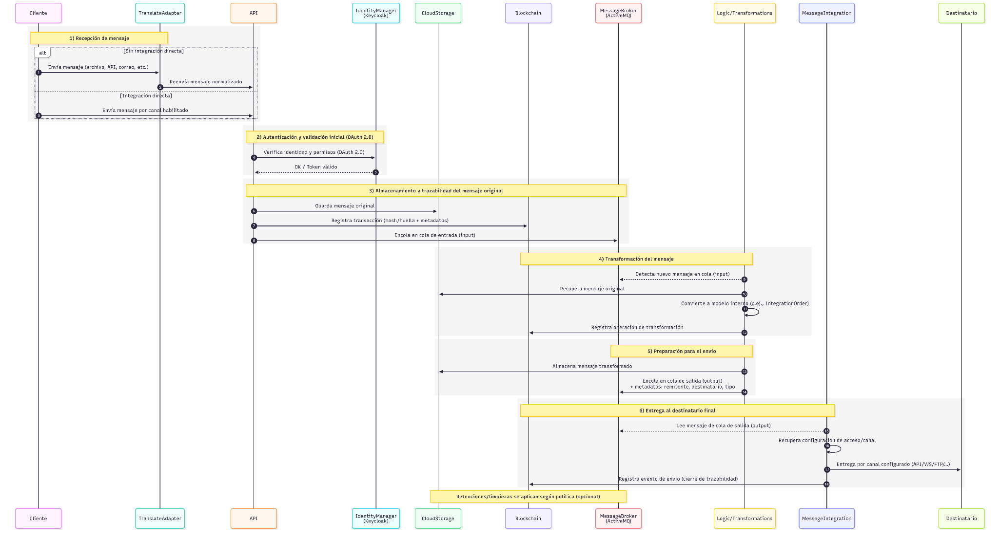

<!-- image -->

Código

TRANSLATE – E2.2

Fecha

Abril 2024

Versión

01

## 1 Contenido

[1	Introducción	4](.)

[2	Tipología de mensajes	5](.)

[3	Modelo de integración	7](.)

[3.1	Principales modelos definidos	7](.)

[4	Procesos de Envío y Recepción	9](.)

[5	Trazabilidad y gestión de errores	11](.)

[5.1	Trazabilidad	11](.)

[5.2	Seguridad	11](.)

[5.3	Gestión de errores	11](.)

[6	Conclusiones	13](.)

## 2 Introducción

El presente documento forma parte de los entregables del proyecto TRANSLATE y tiene como finalidad analizar los elementos esenciales para la integración de mensajes electrónico entre operadores logísticos y plataformas digitales del ámbito portuario. En particular, se enmarca en el proceso de definición funcional y técnica que permitirá garantizar la interoperabilidad eficiente y segura entre múltiples sistemas.

TRANSLATE se concibe como una solución en la nube que actúa como HUB de integración digital (HID), facilitando la conexión entre distintos actores del ecosistema portuario a través de una plataforma común. Para ello, debe soportar diversos formatos de mensajes y proporciona mecanismos de transformación, trazabilidad y auditoría que simplifican y aseguran la comunicación entre sistemas.

En este documento se identifican los tipos de mensajes relevantes, se describe el modelo de integración utilizado por la plataforma, y se detallan los flujos operativos básicos, así como los criterios técnicos y funcionales mínimos para su correcta implementación.

Este análisis constituye la base para las tareas posteriores de diseño y desarrollo en la construcción de la plataforma TRANSLATE.

## 3 Tipología de mensajes

La plataforma TRANSLATE gestionará un conjunto diverso de mensajes electrónicos provenientes de diferentes plataformas participantes en la comunidad portuaria. Estos mensajes son esenciales para la operativa diaria de transporte, control de equipamiento y gestión documental, y su correcta integración es clave para garantizar la interoperabilidad entre sistemas heterogéneos.

TRANSLATE actuará como intermediario inteligente, permitiendo la transformación, trazabilidad y enrutamiento de estos mensajes según las necesidades y configuraciones de cada operador económico.

A continuación, se detallan los principales tipos de mensajes considerados en el análisis, agrupados por plataforma de origen:

- **Mensajería de Transporte Terrestre**
    - **Mensajes de ValenciaPortPCS (PCS del Puerto de Valencia)**
        - **DUT (Documento Único de Transporte):** Instrucción de transporte terrestre que combina la solicitud de traslado, la entrega del equipamiento y la admisión en terminal, todo en un único documento.
        - **ReleaseOrder:** Solicita la liberación del contenedor en terminal o depósito, permitiendo su recogida por parte del transportista.
        - **AcceptanceOrder:** Orden emitida para que un contenedor sea admitido en una instalación.
        - **ITD (In Transit Declaration):** Declaración del tránsito de mercancías dentro del entorno portuario, necesaria para el control aduanero.
        - **AcceptanceConfirmation:** Confirmación de que un contenedor ha sido efectivamente aceptado en una instalación.
        - **ReleaseConfirmation:** Confirmación por parte de la terminal de que el contenedor ha sido liberado y está disponible para recogida.
        - **VERMAS (Verified Gross Mass):** Comunicación obligatoria del peso bruto verificado del contenedor (Normativa SOLAS).
    - **Mensajes de PORTIC (PCS del Puerto de Barcelona)**
        - **IFTMIN2I05 / IFTMINE03:** Órdenes de transporte terrestre asociadas a procesos de importación y exportación respectivamente.
        - **CODECOE06 / CODECOE07 / CODECOI09 / CODECOI08:** Mensajes de notificación de entrada, salida y cambios de estado del contenedor, fundamentalmente para seguimiento logístico.
        - **COPARNE01 / COPARNE02 / COPARNI04:** Se utilizan para informar con antelación la llegada de un contenedor a un terminal o depósito.
        - **CORREORI03:** Permite realizar correcciones sobre mensajes previamente enviados en caso de error o cambios operativos.
        - **COPINOI05 / COPINOI06:** Permiten al transportista comunicar anticipadamente la intención de entrada o salida de un contenedor en una terminal. Se diferencia del COPARN en el emisor.
- **Sumarias (IFCSUM) de ValenciaPortPCS**
    - **IFCSUM (declaraciones sumarias):** transformación, validación y entrega de mensajes IFCSUM, de texto plano a EDI, como caso de uso principal con MSC.
- **Escalas marítimas (BERMAN) a la Ventanilla Única Maritima Europea (EMSWe)**
    - **BERMAN (solicitud de escala):** transformación y entrega de mensajes VID (Visit ID) a partir del BERMAN en formato EDI, al RIM de Fundación ValenciaPort.

## 4 Modelo de integración

Para facilitar la interoperabilidad entre los diferentes actores del ecosistema logístico-portuario, TRANSLATE adopta un enfoque basado en modelos de integración genéricos. Estos modelos permiten desacoplar los formatos de mensaje internos de los operadores logísticos de los formatos específicos exigidos por las plataformas de destino. Entre las principales ventajas de este enfoque destacan:

- Reducción significativa de los esfuerzos de integración para cada plataforma.
- Reutilización de transformación y conectores.
- Escalabilidad funcional para incorporar nuevos servicios y actores.
- Trazabilidad estandarizada y control de versiones.

### 4.1 Principales modelos definidos

- **IntegrationOrder**

Modelo estándar utilizado para representar órdenes de transporte terrestre.

Aglutina la información requerida y compartida por diferentes plataformas, permitiendo una transformación flexible en función del destinatario.

En este caso, los mensajes de orígenes son: **DUT, ReleaseOrder, AcceptanceOrder, ITD, AcceptanceConfirmation y ReleaseConfirmation,** por parte de ValenciaPortPCS. Por el lado de PORTIC se encuentran: **IFTMIN2I05 / IFTMINE03, CODECOE06 / CODECOE07 / CODECOI09 / CODECOI08, COPARNE01 / COPARNE02 / COPARNI04, CORREORI03 y COPINOI05 / COPINOI06** .

- **IfcsumXML**

Modelo intermedio normalizado que encapsula los campos necesarios del mensaje IFCSUM (EDIFACT) para la sumaria y su envío a ValenciaPortPCS.
Estandariza la carga recibida de MSC en texto plano, habilitando una primera transformación **IFCSUM texto plano → IFCSUM XML** y, posteriormente, **IFCSUM XML → IFCSUM EDI** .
Esta separación refuerza la validación, la trazabilidad y la reutilización del segundo paso con otros clientes

- **CusresXML**

Modelo intermedio normalizado para el mensaje CUSRES (EDIFACT), respuesta al IFCSUM.
Orquesta la transformación en sentido inverso: **CUSRES EDI (ValenciaPortPCS) → CUSRES XML → CUSRES texto plano (MSC)** .
Este desacoplo permite reutilizar el mapeo **EDI ↔ XML** con otros clientes y aislar las adaptaciones específicas del formato plano de MSC.

- **ApvBermanXML**

Modelo intermedio normalizado para el mensaje **BERMAN (EDIFACT)** .
Habilita la cadena de transformación **BERMAN EDI → ApvBermanXML → VID (Visit ID)** requerido por la **Ventanilla Marítima Única Europea (EMSWe)** .
Este enfoque separa el mapeo estándar **EDI ↔ XML** de la proyección a **VID** , facilitando validación, trazabilidad y la evolución del modelo conforme a cambios del marco EMSWe.

## 5 Procesos de Envío y Recepción

La plataforma **TRANSLATE** gestiona el intercambio de mensajes electrónicos del ecosistema logístico-portuario mediante un flujo orquestado que garantiza seguridad, trazabilidad e interoperabilidad. Su diseño modular permite adaptarse a los distintos canales de entrada y requisitos técnicos de cada cliente o plataforma, simplificando la transformación de mensajes y asegurando su correcta entrega. El flujo sería:

1. **Recepción de mensaje.**

El Cliente remite un mensaje a TRANSLATE utilizando alguno de los canales habilitados. En los casos donde no hay capacidad técnica para una integración directa, se utilizará **TRANSLATE ADAPTER** , que actúa como intermediario entre el sistema del cliente y la plataforma.

1. **Autenticación y validación inicial.**

El mensaje se envía a la API de TRANSLATE, autenticándose mediante **OAuth 2.0** gestionado por **KeyCloak (Identity Manager)** . Este paso verifica los permisos y la identidad del emisor antes de permitir la operación.

1. **Almacenamiento y trazabilidad del mensaje original.**

Una vez validado, el mensaje se guarda en **Cloud Storage** y la transacción se registra en **Blockchain** para asegurar su trazabilidad. Además, se inserta en el **MessageBroker (ActiveMQ)** en una cola de entrada específica.

1. **Transformación del mensaje.**

El componente **Logic/Transformations** detecta nuevos mensajes en cola y comienza el proceso de transformación. Primero recupera el mensaje original desde almacenamiento, lo convierte al **modelo de integración interno** (como **IntegrationOrder** ), y registra la operación en **Blockchain** **.**

1. **Preparación para el envío.**

El mensaje transformado se almacena en **Cloud Storage** y se introduce en una cola de salida específica en el **Message Broker** , con los metadatos de remitente, destinatario y tipo de mensaje de salida.

1. **Entrega al destinatario final.**

El componente **Message Integration** gestiona los envíos hacia el destinatario, accediendo a la cola de salida, recuperando la configuración de acceso y ejecutando la entrega por el canal configurado. Una vez enviado, se registra el evento en **Blockchain** , completando la trazabilidad.

<!-- image -->

Diagrama  Secuencia de recepción, transformación y envío de mensajes a través de TRANSLATE.

## 6 Trazabilidad y gestión de errores

La plataforma TRANSLATE incorpora mecanismos robustos para garantizar la trazabilidad completa de los mensajes gestionados y la seguridad de la información procesada. Estos mecanismos se aplican de manera transversal a todas las fases del flujo de procesamiento.

### 6.1 Trazabilidad

- **Registro completo de eventos:** Cada transacción es registrada en distintas etapas, permitiendo reconstruir la secuencia completa de procesamiento.
- **Identificación única de mensajes:** Se asigna un identificador único por mensaje que facilita su seguimiento a lo largo de todo el sistema.
- **Auditoría en tiempo real:** Los operadores pueden consultar el estado y los detalles de cada mensaje mediante una interfaz web, incluyendo logs de actividad, errores, confirmaciones de entrega y descarga de ellos.
- **Almacenamiento estructurado:** Tanto los mensajes originales como los transformados se almacenan en Cloud Storage, organizados por empresa, tipo de mensaje y estado.

### 6.2 Seguridad

- **Trazabilidad mediante Blockchain:** Cada transacción es registrada en una red Blockchain privada. Esto garantiza la integridad del contenido y permite evidenciar cualquier modificación o manipulación.
- **Cifrado y autenticación:** Las comunicaciones entre los sistemas de los operadores y TRANSLATE están aseguradas mediante protocolos TLS/SSL. Además, el acceso a las APIs y a la plataforma web está gestionado por un sistema de identidad (Identity Manager) basado en estándares como OAuth 2.0.
- **Control de acceso granular:** Se definen permisos específicos por empresa, tipo de mensaje y acción permitida, limitando el acceso a información sensible.
- **Respaldo y recuperación:** El sistema cuenta con planes  de respaldo automático y planes de recuperación ante fallos para garantizar la continuidad del servicio.

### 6.3 Gestión de errores

- **Detección automatizada de fallos:** La plataforma dispone de mecanismos que monitorean de forma continua cada etapa del procesamiento de mensajes. Ante la ocurrencia de un fallo, el sistema lo identifica inmediatamente y activa los protocolos correspondientes.
- **Reintentos automáticos:** En determinados casos, el sistema está capacitado para ejecutar automáticamente reintentos del proceso fallido, según las políticas establecidas por el operador.
- **Registro de eventos:** Todos los errores, advertencias y eventos anómalos registrados en el sistema de auditoría, lo que permite su revisión y análisis posterior.
- **Gestión configurable:** El comportamiento del sistema ante errores puede ser personalizado según el tipo de mensaje, el canal utilizado y las preferencias del cliente.

## 7 Conclusiones

El presente documento ha permitido establecer una base sólida para comprender y estructurar la integración de mensajes electrónicos dentro del ecosistema portuario, a través de la plataforma TRANSLATE.

Se ha definido una tipología clara de mensajes, se ha estructurado un modelo de integración basado en formatos genéricos y se ha descrito un flujo unificado de procesamiento que garantiza trazabilidad, seguridad, configurabilidad y robustez técnica.

En conjunto, el análisis confirma la viabilidad técnica y funcional de la solución, así como su capacidad para adaptarse a múltiples escenarios operativos. El siguiente paso será avanzar al análisis funcional de la web para luego implementar los flujos definidos.

TRANSLATE simplifica la interoperabilidad entre actores del sector logítico-portuario al centralizar los procesos de integración, transformación, trazabilidad y adaptación.

## Figures

<!-- Image extraction failed: No image data available -->
[Image: Figure fig_2]

<!-- Image extraction failed: No image data available -->
[Image: Figure fig_3]

<!-- Image extraction failed: No image data available -->
[Image: Figure fig_4]
