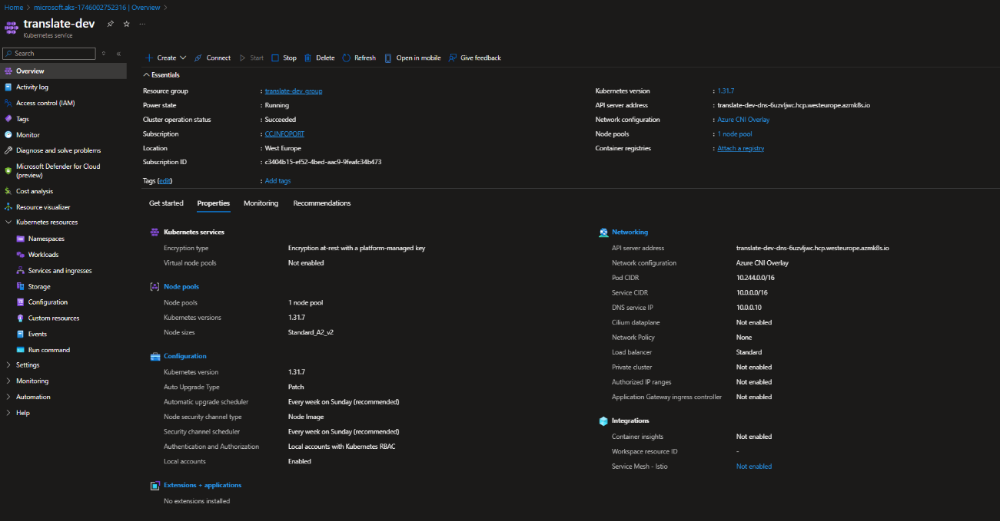
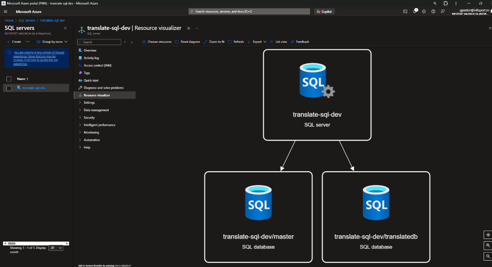
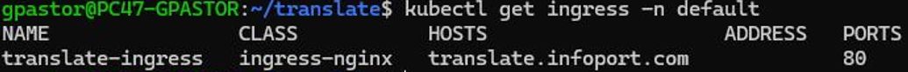

<!-- image -->

Código

TRANSLATE E3.2

Fecha

Diciembre 2024

Versión

01

**Control de versiones**

| VERSIÓN   | FECHA   | DESCRIPCIÓN               |
|-----------|---------|---------------------------|
| 01        |         | Elaboración del documento |
|           |         |                           |
|           |         |                           |
|           |         |                           |

**Aprobación**

*Espacio reservado para firma*

## 1 Contenido

[1	Introducción	4](.)

[2	Principales componentes	4](.)

[3	Archivos	4](.)

[4	Entorno	5](.)

[5	Aplicación	¡Error! Marcador no definido.](.)

[5.1	translate-secrets.yaml	8](.)

[5.2	translate-backend-deployment.yaml	8](.)

[5.3	keycloak-deployment.yaml	10](.)

[5.4	activemq-deployment.yaml	12](.)

[5.5	translate-backend-service.yaml	13](.)

[5.6	keycloak-service.yaml	14](.)

[5.7	activemq-service.yaml	14](.)

[5.8	translate-ingress.yaml	15](.)

[5.9	init-schema-job.yaml	16](.)

## 2 Introducción

Este informe tiene como finalidad evidenciar el cumplimiento del entregable E3.2 del proyecto TRANSLATE, correspondiente al despliegue de la plataforma PaaS en entorno cloud.

## 3 Principales componentes

- **Broker de mensajería:** Apache Active MQ Artemis.
- **Gestor de identidades:** Keycloak v16.1
- **Base de datos:** SQL Server (as a service)
- **Blockchain:** Hyperledger Fabric
- **TRANSLATE Back:**
- **TRANSLATE Front:**
- **Orquestación con Kubernetes**

## 4 Archivos

- **translate-secrets.yaml:** Almacena información sensible de forma segura, como cadena de conexión a la base de datos y al almacenamiento de Azure.
- **translate-backend-deployment.yaml:** Despliega el backend de TRANSLATE en Kubernetes.
- **keycloak-deployment.yaml:** Despliega el servicio del gestor de identidades Keycloak.
- **activemq-deployment.yaml:** Despliega el bróker de mensajería Apache ActiveMQ.
- **translate-backend-service.yaml:** Crea un Servicio interno para acceder al backend.
- **keycloak-service.yaml:** Expone el servicio interno para acceder a las colas de administración y APIs de Keycloak.
- **activemq-service.yaml:** Expone ActiveMQ como servicio interno para permitir que otros pods envíen o reciban mensajes de la cola.
- **translate-ingress.yaml:** Crea un punto de entrada único para exponer los servicios al exterior mediante HTTPS.
- **init-schema-job.yaml:** Ejecuta un contenedor temporal que se conecta a Azure SQL para crear las tablas de la base de datos.
- **Front**
- **Fachada**
- **Jobs (servicios en batch) – Ubuntu.**

## 5 Entorno

Este script automatiza el despliegue completo de la infraestructura del proyecto TRANSLATE en Microsoft Azure incluyendo bases de datos, almacenamiento, servicios de identidad y contenedores orquestados.

#!/bin/bash

# Definición de variables sin el valor por motivos de seguridad.

RESOURCE\_GROUP="PRIVADO"

LOCATION="PRIVADO"

AKS\_NAME="PRIVADO"

ACR\_NAME="PRIVADO"

STORAGE\_ACCOUNT="translatestordev"

SQL\_SERVER\_NAME="translate-sql-dev"

SQL\_DB\_NAME="translatedb"

ADMIN\_USER="PRIVADO"

ADMIN\_PASS="PRIVADO"

KEYVAULT\_NAME="PRIVADO"

# CREACIÓN DE INFRAESTRUCTURA BASE

echo "Creando grupo de recursos..."

az group create --name $RESOURCE\_GROUP --location $LOCATION

echo "Creando Azure Key Vault..."

az keyvault create --name $KEYVAULT\_NAME --resource-group $RE-SOURCE\_GROUP --location $LOCATION

az keyvault secret set --vault-name $KEYVAULT\_NAME --name "SqlAdminPassword" --value $ADMIN\_PASS

echo "Creando Azure SQL Server + Database..."

az sql server create --name $SQL\_SERVER\_NAME --resource-group $RE-SOURCE\_GROUP \

--location $LOCATION --admin-user $ADMIN\_USER --admin-password $ADMIN\_PASS

az sql db create --resource-group $RESOURCE\_GROUP --server $SQL\_SERVER\_NAME \

--name $SQL\_DB\_NAME --service-objective S1

az sql server firewall-rule create --resource-group $RESOURCE\_GROUP --server $SQL\_SERVER\_NAME \

--name "AllowAzureServices" --start-ip-address 0.0.0.0 --end-ip-address 0.0.0.0

echo "Creando Azure Storage Account para mensajes..."

az storage account create --name $STORAGE\_ACCOUNT --resource-group $RESOURCE\_GROUP \

--location $LOCATION --sku Standard\_LRS

echo "Creando Azure Container Registry..."

az acr create --resource-group $RESOURCE\_GROUP --name $ACR\_NAME --sku Basic --admin-enabled true

echo "Creando Azure Kubernetes Service (AKS)..."

az aks create --resource-group $RESOURCE\_GROUP --name $AKS\_NAME \

--node-count 3 --enable-addons monitoring --generate-ssh-keys --attach-acr $ACR\_NAME

az aks get-credentials --resource-group $RESOURCE\_GROUP --name $AKS\_NAME

# DEPLOY DE COMPONENTES CLAVE EN K8S

echo "Desplegando Keycloak (Identity Manager)..."

kubectl apply -f k8s/keycloak-deployment.yaml

echo "Desplegando ActiveMQ (Message Broker)..."

kubectl apply -f k8s/activemq-deployment.yaml

echo "Desplegando la aplicación principal (backend, frontend)..."

kubectl apply -f k8s/translate-backend-deployment.yaml

kubectl apply -f k8s/translate-frontend-deployment.yaml

echo "Desplegando servicios de integración y trazabilidad..."

kubectl apply -f k8s/translate-ingress.yaml

# Script SQL de inicialización

echo "Ejecutando script SQL de inicialización..."

sqlcmd -S ${SQL\_SERVER\_NAME}.database.windows.net -U $ADMIN\_USER -P $ADMIN\_PASS \

-d $SQL\_DB\_NAME -i init-schema.sql

echo "Despliegue completado correctamente."

<!-- image -->

Pantalla   Despliegue del cluster en Azure.

## 6 Códigos de despliegue

Los siguientes códigos despliegan los componentes de la aplicación y sus servicios.

### 6.1 translate-secrets.yaml

apiVersion: v1

kind: Secret

metadata:

name: translate-secrets

namespace: default

type: Opaque

data:

sql-connection-string: PRIVADO

azure-storage-connection: PRIVADO

### 6.2 translate-frontend-deployment.yaml

apiVersion: apps/v1

kind: Deployment

metadata:

name: translate-frontend

spec:

replicas: 2

selector:

matchLabels:

app: translate

tier: frontend

template:

metadata:

labels:

app: translate

tier: frontend

spec:

containers:

- name: frontend

image: translate.azurecr.io/translate-frontend:latest

ports:

- containerPort: 80

resources:

requests:

memory: "128Mi"

cpu: "100m"

limits:

memory: "256Mi"

cpu: "250m"

readinessProbe:

httpGet:

path: /

port: 80

initialDelaySeconds: 5

periodSeconds: 10

livenessProbe:

httpGet:

path: /

port: 80

initialDelaySeconds: 15

periodSeconds: 20

### 6.3 translate-backend-deployment.yaml

apiVersion: apps/v1

kind: Deployment

metadata:

name: translate-backend

spec:

replicas: 2

selector:

matchLabels:

app: translate

tier: backend

template:

metadata:

labels:

app: translate

tier: backend

spec:

containers:

- name: backend

image: translate.azurecr.io/translate-backend:latest

ports:

- containerPort: 8080

env:

- name: ConnectionStrings\_\_DefaultConnection

valueFrom:

secretKeyRef:

name: translate-secrets

key: sql-connection-string

- name: AzureStorage\_\_Connection

valueFrom:

secretKeyRef:

name: translate-secrets

key: azure-storage-connection

- name: ASPNETCORE\_ENVIRONMENT

value: Production

resources:

requests:

memory: "256Mi"

cpu: "250m"

limits:

memory: "512Mi"

cpu: "500m"

### 6.4 keycloak-deployment.yaml

apiVersion: apps/v1

kind: Deployment

metadata:

name: keycloak

spec:

replicas: 1

selector:

matchLabels:

app: keycloak

template:

metadata:

labels:

app: keycloak

spec:

containers:

- name: keycloak

image: translate.azurecr.io/translate-keycloak:latest

env:

- name: PRIVADO

value: PRIVADO

ports:

- containerPort: 8080

resources:

requests:

memory: "256Mi"

cpu: "250m"

limits:

memory: "512Mi"

cpu: "500m"

### 6.5 activemq-deployment.yaml

apiVersion: apps/v1

kind: Deployment

metadata:

name: activemq

spec:

replicas: 1

selector:

matchLabels:

app: activemq

template:

metadata:

labels:

app: activemq

spec:

containers:

- name: activemq

image: translate.azurecr.io/translate-activemq:latest

ports:

- containerPort: 61616

resources:

requests:

memory: "512Mi"

cpu: "250m"

limits:

memory: "1Gi"

cpu: "500m"

volumeMounts:

- name: activemq-data

mountPath: /opt/activemq/data

volumes:

- name: activemq-data

emptyDir: {}

### 6.6 translate-frontend-service.yaml

apiVersion: v1

kind: Service

metadata:

name: translate-frontend-service

spec:

selector:

app: translate

tier: frontend

ports:

- protocol: TCP

port: 80

targetPort: 80

type: ClusterIP

### 6.7 translate-backend-service.yaml

apiVersion: v1

kind: Service

metadata:

name: translate-backend-service

spec:

selector:

app: translate

tier: backend

ports:

- protocol: TCP

port: 80

targetPort: 8080

type: ClusterIP

### 6.8 keycloak-service.yaml

apiVersion: v1

kind: Service

metadata:

name: keycloak-service

spec:

selector:

app: keycloak

ports:

- protocol: TCP

port: 80

targetPort: 8080

type: ClusterIP

### 6.9 activemq-service.yaml

apiVersion: v1

kind: Service

metadata:

name: activemq-service

spec:

selector:

app: activemq

ports:

- protocol: TCP

port: 61616

targetPort: 61616

type: ClusterIP

### 6.10 translate-ingress.yaml

apiVersion: networking.k8s.io/v1

kind: Ingress

metadata:

name: translate-ingress

annotations:

nginx.ingress.kubernetes.io/ssl-redirect: "true"

nginx.ingress.kubernetes.io/backend-protocol: "HTTP"

nginx.ingress.kubernetes.io/rewrite-target: /$1

spec:

rules:

- host: translate.example.com

http:

paths:

- path: /backend(/|$)(.*)

pathType: Prefix

backend:

service:

name: translate-backend-service

port:

number: 80

- path: /keycloak(/|$)(.*)

pathType: Prefix

backend:

service:

name: keycloak-service

port:

number: 80

- path: /frontend(/|$)(.*)

pathType: Prefix

backend:

service:

name: translate-frontend-service

port:

number: 80

tls:

- hosts:

- translate.example.com

secretName: tls-secret

### 6.11 init-schema-job.yaml

apiVersion: batch/v1

kind: Job

metadata:

name: init-schema

spec:

template:

spec:

containers:

- name: sql-init

image: mcr.microsoft.com/mssql-tools

command: ["/bin/bash", "-c"]

args:

- sqlcmd -S translate-sql-dev.database.windows.net -U translateadmin -P $(SQL\_PASS) -d translatedb -i /init/init-schema.sql;

env:

- name: SQL\_PASS

valueFrom:

secretKeyRef:

name: translate-secrets

key: sql-connection-string

volumeMounts:

- name: init-volume

mountPath: /init

restartPolicy: OnFailure

volumes:

- name: init-volume

configMap:

name: init-schema-sql

## 7 Capturas

<!-- image -->

Pantalla   Estructura de recursos SQL para TRANSLATE en AZURE

<!-- image -->

Pantalla   "Detalles del recurso de almacenamiento Azure translatestordev para TRANSLATE.

<!-- image -->

Pantalla   PODS desplegados

<!-- image -->

Pantalla   Deployments

<!-- image -->

Pantalla   Services

<!-- image -->

Pantalla   secret

<!-- image -->

Pantalla   Ingress

## Figures

<!-- Image extraction failed: No image data available -->
[Image: Figure fig_9]
