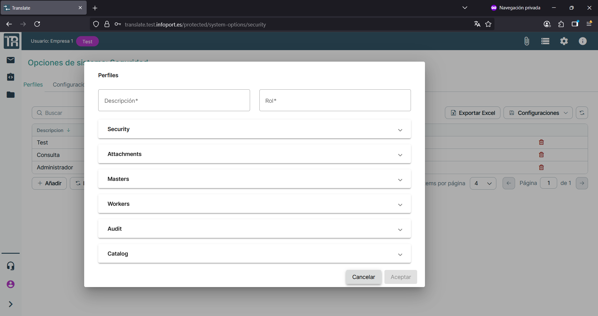
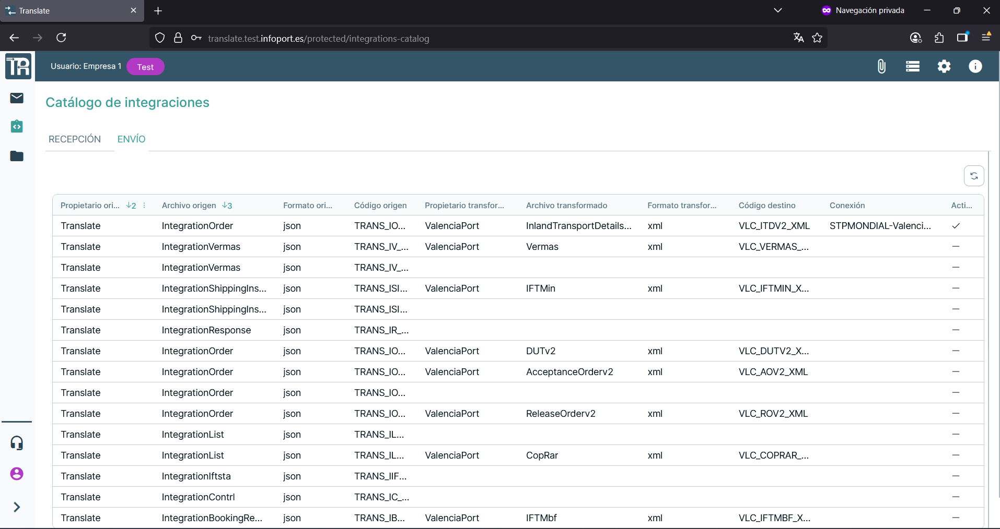
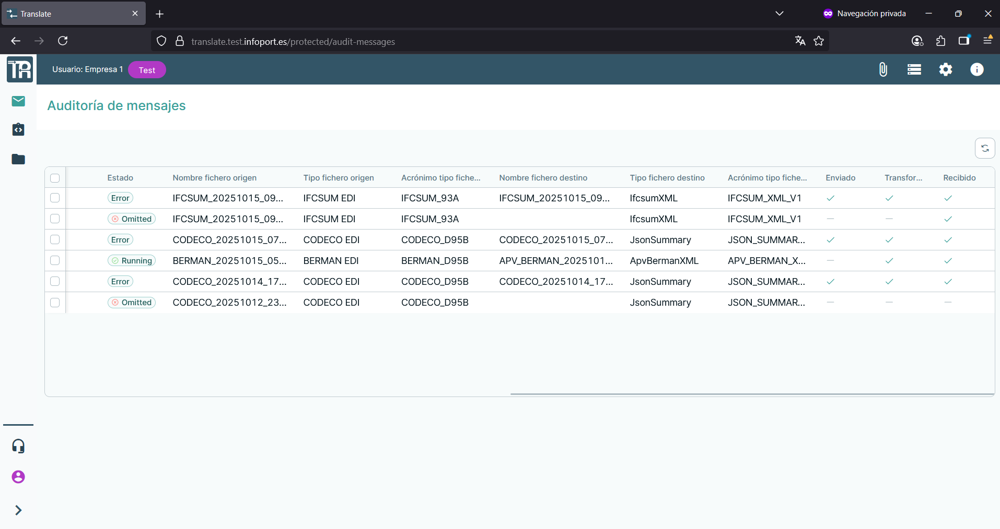
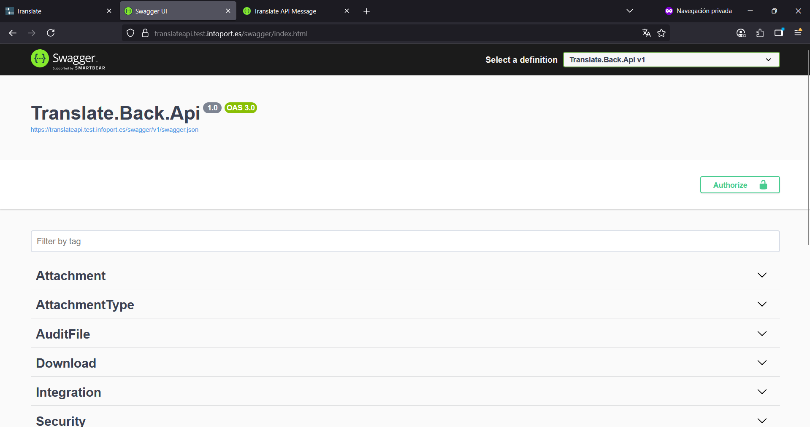

<!-- image -->

Código

TRANSLATE – E3.3

Fecha

Diciembre 2024

Versión

01

**Control de versiones**

| VERSIÓN   | FECHA   | DESCRIPCIÓN               |
|-----------|---------|---------------------------|
| 01        |         | Elaboración del documento |
|           |         |                           |
|           |         |                           |
|           |         |                           |

**Aprobación**

*Espacio reservado para firma*

## 1 Contenido

[1	Introducción	4](.)

[2	Funcionalidades principales	4](.)

[2.1	Entidades	5](.)

[2.2	Gestión de catálogos	7](.)

[2.3	Panel de trazabilidad	8](.)

[2.4	Swagger	9](.)

[3	Conclusiones	¡Error! Marcador no definido.](.)

## 2 Introducción

Este informe tiene como finalidad evidenciar el cumplimiento del entregable E3.3 del proyecto TRANSLATE, correspondiente a la web de administración.

## 3 Funcionalidades principales

En este apartado se muestran las pantallas funcionales de la web de administración de la aplicación comenzando con la pantalla para el inicio de sesión.

<!-- image -->

Pantalla   Login de la aplicación

### 3.1 Entidades

En este apartado se presentan las pantallas y funcionalidades principales relacionadas con la creación y configuración de entidades dentro de la web de administración de TRANSLATE. Estas operaciones permiten dar de alta nuevas empresas, definir sus características y establecer los parámetros necesarios para su integración y operativa dentro de la plataforma.

<!-- image -->

Pantalla   Listado de entidades

<!-- image -->

Pantalla   Alta de entidades.

<!-- image -->

Pantalla   Modificación de datos

### 3.2 Gestión de catálogos

En esta sección se expone la funcionalidad de la web de administración relacionada con la gestión del catálogo de integraciones. A través de esta pantalla el administrador puede consultar y configurar los distintos tipos de integraciones disponibles en la plataforma TRANSLATE.

<!-- image -->

Pantalla   Catálogo de integraciones – Recepción.

<!-- image -->

Pantalla    Catálogo de integraciones – Envío.

### 3.3 Panel de trazabilidad

En esta sección se presenta la funcionalidad de auditoría y trazabilidad de mensajes procesados en la plataforma TRANSLATE. A través de esta pantalla el administrador puede consultar el estado de los mensajes recibidos, transformados y enviados, y las posibles incidencias o errores asociados.

<!-- image -->

<!-- image -->

Pantalla   Panel de trazabilidad – Auditoría de mensajería.

### 3.4 Swagger

Como complemento a la documentación sobre integraciones, se presenta la forma de documentar las integraciones con el uso de la herramienta **Swagger.**

<!-- image -->

<!-- image -->

Pantalla   Documentación de integraciones.

## Figures

<!-- Image extraction failed: No image data available -->
[Image: Figure fig_11]
